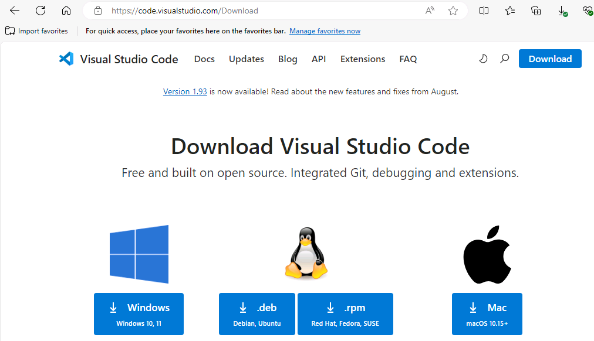
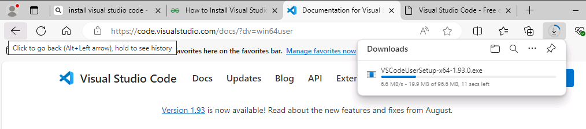
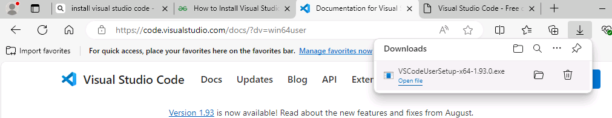
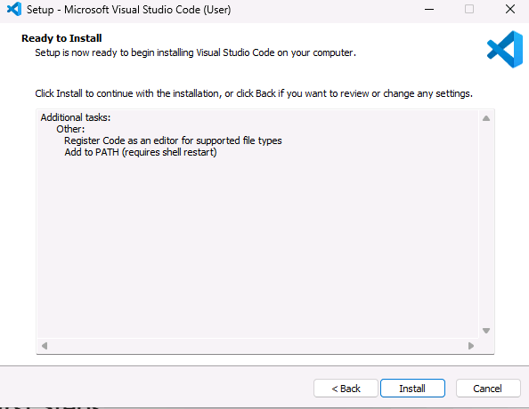
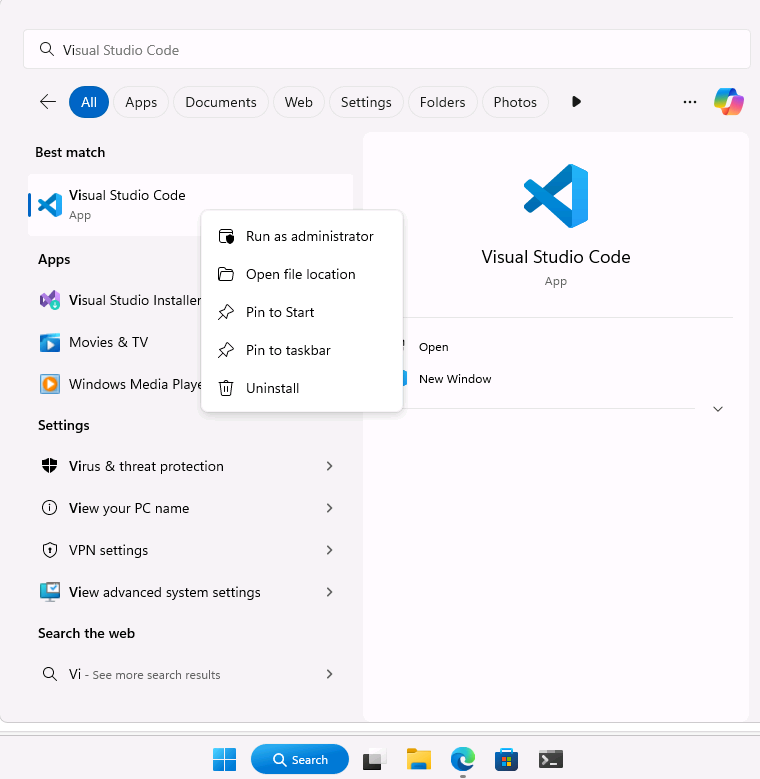

# Task 02 - Install and update Visual Studio Code 

<!--- Estimated time: 5 minutes---> 

## Introduction

Visual Studio Code (VS Code) is a free, open-source code editor developed by Microsoft. It’s highly popular among developers due to its versatility and extensive feature set. You’ll use Visual Studio Code throughout this lab to view and modify files and to run commands.

{: .note }
> It’s important that you check for and install any updates for Visual Studio Code. Some of the extensions that you’ll use in this lab require the latest version of Visual Studio Code.

## Description

In this task, you’ll determine whether Visual Studio Code is installed on your machine and install the tool if necessary. You’ll also check to ensure that the latest version of Visual Studio Code is installed.

The key steps are as follows:

1. Identify whether Visual Studio Code is installed on your machine.
1. Check for updates and install updates if necessary.
1. Launch Visual Studio Code as an administrator.

## Success Criteria

- Visual Studio Code is installed and updated. 
- You’ve launched Visual Studio Code as an administrator.

## Learning Resources

- [**Introduction to Visual Studio Code**](https://learn.microsoft.com/en-us/training/modules/introduction-to-visual-studio-code/)

## Solution

Expand this section to view the solution

  
1. On the taskbar for your machine, search for **Visual Studio Code**.

1. In the Search results, select **Visual Studio Code** to open the app. Then, on the menu bar, select **Help** and then select **Check for Updates**. Follow instructions to install any updates. If you don’t have the option, you’ll need to download and install Visual Studio Code using the following steps.

    {: .warning }
    > If Visual Studio Code is up to date, skip the remaining steps in this task and move to the next task. Otherwise, complete the following steps to install Visual Studio Code.

1. Open a web browser and go to [**Download Visual Studio Code**](https://code.visualstudio.com/Download). 

    

1. Select **Windows**. The app installer should start downloading immediately.

    

1. When the download completes, select **Open file**.

    

1. On the **Setup** page, select **I accept the agreement** and then select **Next** twice. Select **Install**. Wait while the app installs.

    

1. When installation completes, clear the **Launch Visual Studio Code** checkbox and select **Finish**. 

	{: .warning }
	> If you don’t clear the checkbox, Visual Studio Code will launch as a standard user. Some actions in the following tasks won’t succeed if you’re not running Visual Studio Code as an administrator. Follow the remaining steps in this task to launch Visual Studio Code as an administrator.

1. On the taskbar for your machine, search for **Visual Studio Code**.

1. In the list of search results, right-click **Visual Studio Code** and select **Run as administrator**.

    

1. On the **User Account Control** page, select **Yes**.

1. Leave Visual Studio Code open. You’ll use the tool again in the next task.

