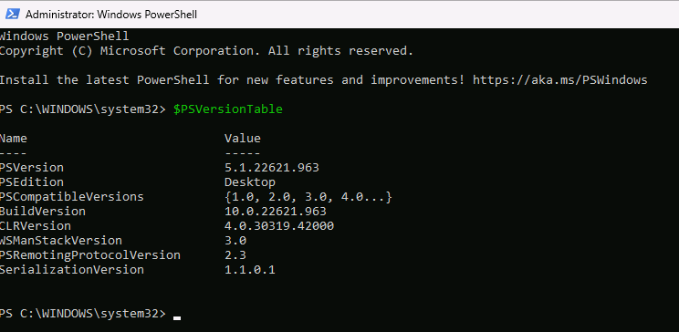
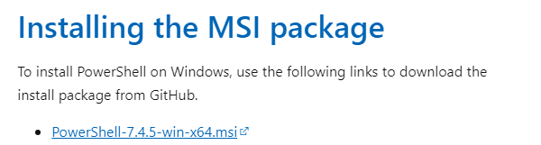
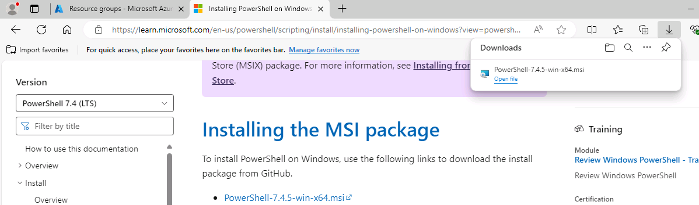
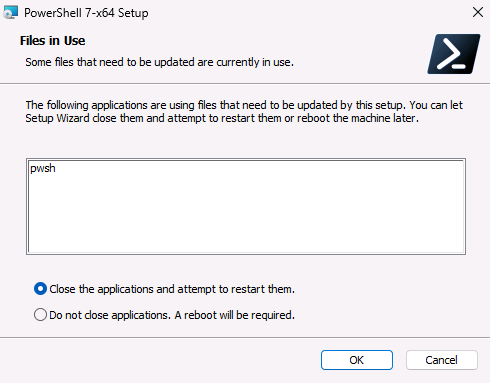
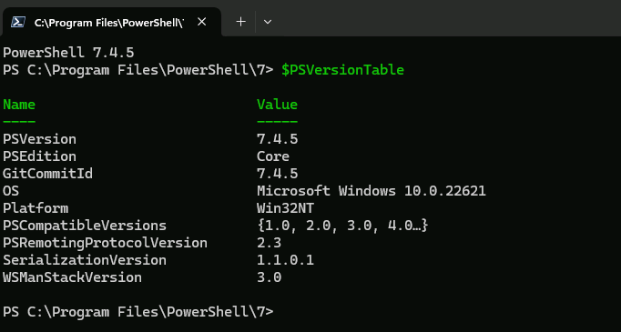

# Task 03 - Upgrade PowerShell

<!--- Estimated time: 5 minutes---> 

## Introduction

PowerShell is a powerful task automation and configuration management framework from Microsoft. It consists of a command-line shell, a scripting language, and a configuration management framework. To perform some steps in this lab, you must use PowerShell version 7 or greater. 

## Description

In this task, you’ll determine which version of PowerShell is installed on your machine and upgrade PowerShell if necessary.

The key steps are as follows:

1. Check to see which version of PowerShell is installed.
1. Upgrade PowerShell to the latest version if necessary.
1. Verify the PowerShell version.

## Success Criteria

- You’ve installed PowerShell version 7 or greater. 

## Learning Resources

- [**What is PowerShell?**](https://learn.microsoft.com/en-us/powershell/scripting/overview?view=powershell-7.4)

## Solution

<details markdown="block">
<summary>Expand this section to view the solution</summary>

1. On the Visual Studio Code menu bar, select **Terminal** and then select **New Terminal**. A Terminal pane opens at the bottom of the window.

1. Enter the following command at the Terminal window prompt. This command displays details about the PowerShell environment, including the PowerShell version.

    ```
    $PSVersionTable
    ```

    

   {: .warning }
   > If the value for PSVersion is at least 7, skip the remaining steps in this task and move on to the next task. Otherwise, complete the following steps to upgrade PowerShell.

1. Open a web browser and go to [**Installing PowerShell on Windows**](https://learn.microsoft.com/en-us/powershell/scripting/install/installing-powershell-on-windows?view=powershell-7.4). 

1. Scroll to the **Installing the MSI package** section and select the link for the 64-bit version of the installer. Wait for the installer package to download.

    

1. When the download completes, select **Open file**.

    

1. On the **Setup** page, select **Next** four times and then select **Install**.

1. On the **User Account Control** page, select **Yes**.

1. If the **Files in Use** page displays, select **OK**.

        

1. When the installation completes, select **Finish**.

1. Enter the following command at the prompt in the Terminal window. Verify that PSVersion is at least 7.x.

    ```
    $PSVersionTable
    ```

    

   {: .warning }
   > If you installed the latest version of PowerShell but the results from the $PSVersionTable command don’t show the latest version, reboot your computer and run the command again.  

1. Leave Visual Studio Code open. You’ll use the tool again in the next task.

</details>
