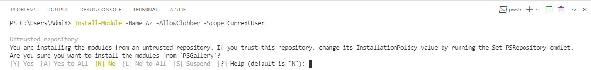
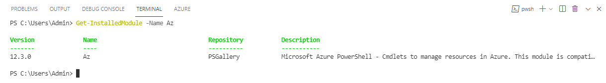

# Task 04 - Install the PowerShell Az module

<!--- Estimated time: 5 minutes---> 

## Introduction

The Az PowerShell module is a set of cmdlets for managing Azure resources directly from PowerShell. It’s the recommended module for interacting with Azure, replacing the older AzureRM module. You’ll use PowerShell Az module commands in this lab. 

## Description

In this task, you’ll install the Az PowerShell module.

The key steps are as follows:

1. Run a command to install the Az PowerShell module.
1. Verify that the module is correctly installed.

## Success Criteria

- You’ve successfully installed the Az PowerShell module. 

## Learning Resources

- [**Introducing the Az PowerShell module**](https://learn.microsoft.com/en-us/powershell/azure/new-azureps-module-az?view=azps-12.3.0)
- [**Azure PowerShell Cheat Sheet**](https://github.com/andreipintica/Azure-PowerShell-CheatSheet)

## Solution

<details markdown="block">
<summary>Expand this section to view the solution</summary>

1. Enter the following command at the Terminal window prompt. This command installs the PowerShell Az module. 

    ```
    Install-Module -Name Az -AllowClobber -Scope CurrentUser
    ```

    

1. Select **A** to install the modules from PSGallery and then select **Enter**. Wait for the installation to complete.

   {: .note }
   > It may take 2-3 minutes for the installation to complete. The Terminal window may become temporarily unresponsive during installation.

1. Enter the following command at the Terminal window prompt and then select **Enter**. This command verifies that the Az module is properly installed.

    ```
    Get-InstalledModule -Name Az
    ```

    

1. Leave Visual Studio Code open. You’ll use the tool again in the next task.

</details>
