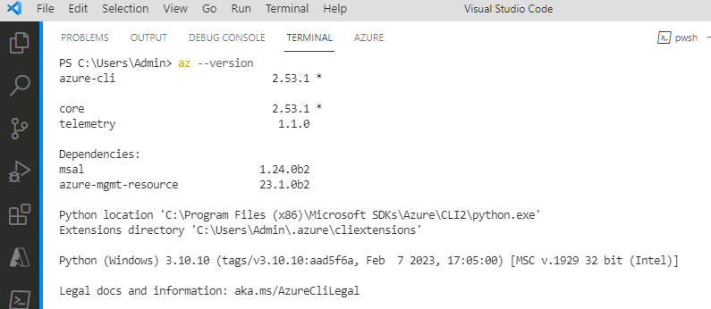
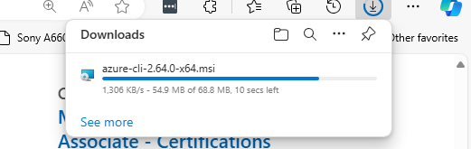
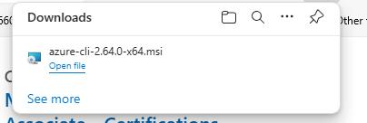

# Task 05 - Install Azure CLI 

You’ll use Azure CLI to run commands for this lab.

<!--- Estimated time: 5 minutes---> 

## Introduction

The Azure Command-Line Interface (CLI) is a cross-platform command-line tool designed to manage Azure resources. You can use the Azure CLI to authenticate to Azure and to manage resources. 

## Description

In this task, you’ll ensure that Azure CLI is installed and install Azure CLI if needed.

The key steps are as follows:

1. Run a command to determine whether Azure CLI is installed.
1. Install Azure CLI if necessary.
1. Verify that the Azure CLI is correctly installed.

## Success Criteria

- You’ve successfully installed Azure CLI.

## Learning Resources

- [**What is the Azure CLI?**](https://learn.microsoft.com/en-us/cli/azure/what-is-azure-cli)
- [**Azure CLI documentation**](https://learn.microsoft.com/en-us/cli/azure/)

## Solution

<details markdown="block">
<summary>Expand this section to view the solution</summary>

1. Enter the following command at the Visual Studio Code Terminal window prompt and then select **Enter**. This command returns the Azure CLI version if Azure CLI is installed. 

    ```
    az --version
    ```

    

   {: .warning }
   > If Azure CLI 2.53.1 or above is installed, skip the remaining steps in this task and move to the next task. Otherwise, complete the following steps to install Git.

1. Open a web browser and go to [**Install Azure CLI on Windows**](https://learn.microsoft.com/en-us/cli/azure/install-azure-cli-windows?tabs=azure-cli).

1. In the **Latest version** section of the page, select **Latest MSI of the Azure CLI (64-bit)**. Wait while the MSI package downloads.

    

1. When the download completes, select **Open file**.

    

1. In the **Setup** dialog that displays, accept the license agreement and then select **Install**.

1. On the **User Account Control** page, select **Yes**. Wait while Azure CLI installs.

1. In the **Setup** dialog, select **Finish**.

1. Return to Visual Studio Code. Enter the following command at the Terminal window prompt and then select **Enter**. Verify that the command returns the Git version. 

    ```
    az --version
    ```

1. Leave Visual Studio Code open. You’ll use the tool again in the next task.

</details>

