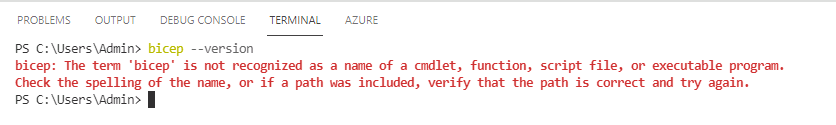
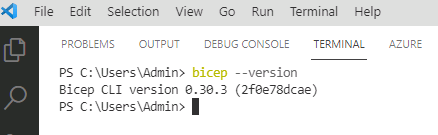

# Task 06 - Install the Bicep extension for Azure CLI

<!--- Estimated time: 3 minutes---> 

## Introduction

Azure Bicep is a domain-specific language (DSL) designed for deploying Azure resources using a declarative syntax. It simplifies the process of creating Azure Resource Manager (ARM) templates, making it easier to define and manage your infrastructure as code. You’ll use Bicep commands in this lab.

## Description

In this task, you’ll ensure that the Bicep extension for Azure CLI is installed and install the Bicep extension if needed. You’ll also add Bicep to the system environment path.

The key steps are as follows:

1. Run a command to determine whether Azure Bicep is installed.
1. Install Azure Bicep if necessary.
1. Verify that the Azure Bicep is correctly installed.

## Success Criteria

- You’ve successfully installed Azure Bicep.

## Learning Resources

- [**What is Bicep?**](https://learn.microsoft.com/en-us/azure/azure-resource-manager/bicep/overview?tabs=bicep)

## Solution

<details markdown="block">
<summary>Expand this section to view the solution</summary>

1. Enter the following command at the Visual Studio Code Terminal window prompt and then select **Enter**. This command returns the Bicep version if Bicep is installed. 

    ```
    bicep --version
    ```

    

   {: .warning }
   > If the Bicep extension is installed, skip the remaining steps in this task and move to the next task. Otherwise, complete the following steps to install the extension.

1. Enter the following commands at the Visual Studio Code Terminal window prompt and then select **Enter**. These commands install Bicep and add Bicep to the environment path.

    ```
    $installPath = "$env:USERPROFILE\.bicep"
    $installDir = New-Item -ItemType Directory -Path $installPath -Force
    $installDir.Attributes += 'Hidden'
    (New-Object Net.WebClient).DownloadFile("https://github.com/Azure/bicep/releases/latest/download/bicep-win-x64.exe", "$installPath\bicep.exe")
    $currentPath = (Get-Item -path "HKCU:\Environment" ).GetValue('Path', '', 'DoNotExpandEnvironmentNames')
    if (-not $currentPath.Contains("%USERPROFILE%\.bicep")) { setx PATH ($currentPath + ";%USERPROFILE%\.bicep") }
    if (-not $env:path.Contains($installPath)) { $env:path += ";$installPath" }
    ```

1. Return to Visual Studio Code. Enter the following command at the Terminal window prompt and then select **Enter**. Verify that the command returns the Git version. 

    ```
    bicep --version
    ```

    

1. Leave Visual Studio Code open. You’ll use the tool again in the next task.

</details>
