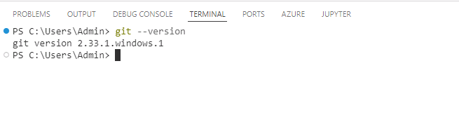
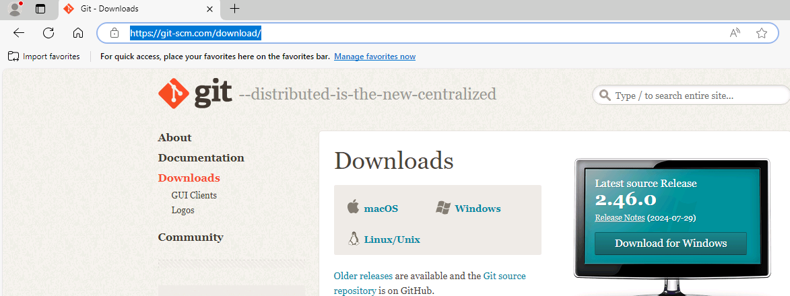
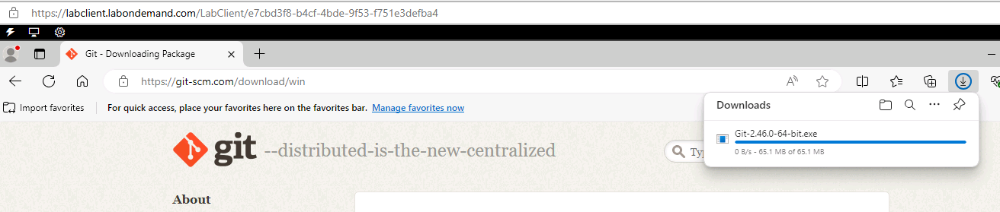
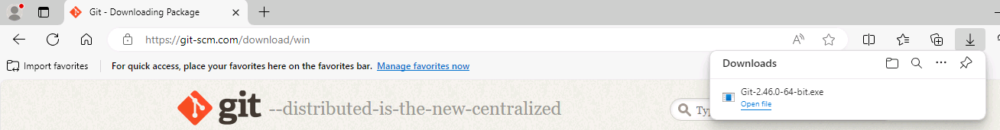
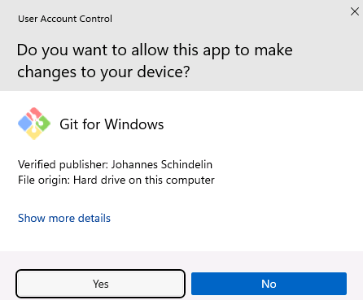
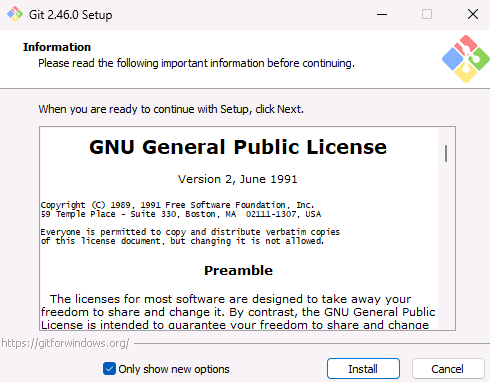

# Task 07 - Install Git 


<!--- Estimated time: 5 minutes---> 

## Introduction

Git is a distributed version control system designed to track changes in source code during software development. GitHub is a web-based platform that uses Git, the popular version control system, to help developers manage and collaborate on code projects. You’ll use Git commands to clone GitHub repositories for this lab and perform other related actions.

## Description

In this task, you’ll ensure that Git is installed and install Git if needed. 

The key steps are as follows:

1. Run a command to determine whether Git is installed.
1. Install Git if necessary.
1. Verify that Git is correctly installed.

## Success Criteria

- You’ve successfully installed Git.

## Learning Resources

- [**What is Git?**](https://learn.microsoft.com/en-us/devops/develop/git/what-is-git)
- [**Introduction to GitHub**](https://learn.microsoft.com/en-us/training/modules/introduction-to-github/)
- [**Collaborate with Git**](https://learn.microsoft.com/en-us/training/modules/collaborate-with-git/")

## Solution

<details markdown="block">
<summary>Expand this section to view the solution</summary>

1. Enter the following command at the Visual Studio Code Terminal window prompt and then select **Enter**. This command returns the Git version if Git is installed. 

    ```
    git --version
    ```

    

   {: .warning }
   > If Git is installed, skip the remaining steps in this task and move to the next task. Otherwise, complete the following steps to install Git.

1. Open a web browser and go to [**Git Downloads**](https://git-scm.com/download/). Select **Download for Windows**.

    

1. On the **Download for Windows** page, select **Click here to download**. The installer should start downloading immediately.

    

1. When the download completes, select **Open file**.

    

1. If a **User Account Control** dialog displays, select **Yes**.

    

1. In the **Git Setup** dialog, select **Install**. Wait while Git installs.

    

1. In the **Git Setup** dialog, select **Finish**.

    

1. Return to Visual Studio Code. Enter the following command at the Terminal window prompt and then select **Enter**. Verify that the command returns the Git version. 

    ```
    git --version
    ```

1. Leave Visual Studio Code open. You’ll use the tool again in the next task.

</details>
