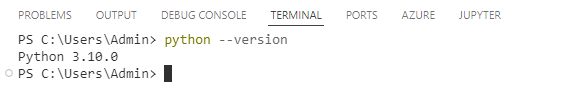
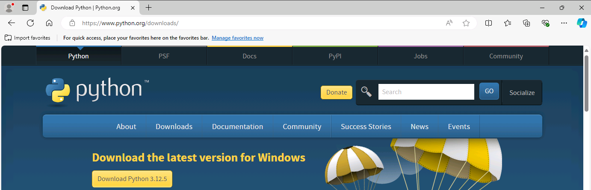
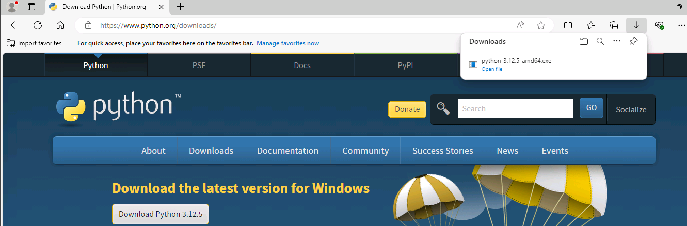
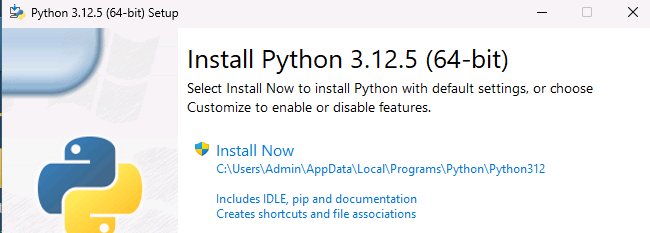
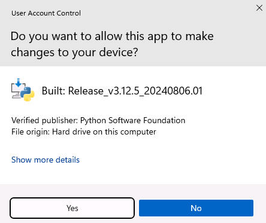
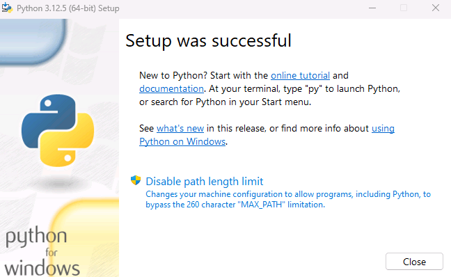

# Task 08 - Install Python 

<!--- Estimated time: 5 minutes---> 

## Introduction

Python is a versatile, high-level programming language known for its readability and ease of use. It supports multiple programming paradigms, including procedural, object-oriented, and functional programming. Python is widely used in various fields such as web development, data science, artificial intelligence, automation, and more. The legacy Contoso Hotel app that you’ll deploy uses Python code. 

## Description

In this task, you’ll ensure that Python is installed and install Python if needed.

The key steps are as follows:

1. Run a command to determine whether Python is installed.
1. Install Python if necessary.
1. Verify that Python is correctly installed.

## Success Criteria

- You’ve successfully installed Python.

## Learning Resources

- [**Introduction to Python?**](https://learn.microsoft.com/en-us/training/modules/intro-to-python/)
- [**Create and manage projects in Python**](https://learn.microsoft.com/en-us/training/modules/python-create-manage-projects/)
- [**Collaborate with Git**](https://learn.microsoft.com/en-us/training/modules/collaborate-with-git/")

## Solution

<details markdown="block">
<summary>Expand this section to view the solution</summary>

1. Enter the following command at the Visual Studio Terminal window prompt and then select **Enter**. This command returns the Python version if Python is installed. 

    ```
    python --version
    ```

    

   {: .warning }
   > If Python version 3.10 to 3.12 is installed, skip the remaining steps in this task and move on to the next task. If Python is not installed, complete the following steps to install Python. **If Python version 3.13 is installed, uninstall Python and then complete the following steps to install Python.**

1. Open a web browser and go to [**Download the latest version for Windows**](https://www.python.org/downloads/). 

    

1. Scroll down to the **Looking for a specific release** section and then locate version **3.12.7**. Select the **Download** link for version 3.12.7.

   {: .warning }
   > Version 3.13 **does not** support the Prompt Flow tools that the lab requires. You must use Python version 3.10, 3.11, or 3.12 for this lab.

1. When the download completes, select **Open file**.

    

1. In the **Python Setup** dialog, select **Install Now**. 

    

1. If a **User Account Control** dialog displays, select **Yes**. Wait while Python installs.

    

1. In the **Python Setup** dialog, select **Close**.

    

1. Return to Visual Studio Code. Enter the following command at the Terminal window prompt and then select **Enter**. Verify that the command returns the Python version. 

    ```
    python --version
    ```

1. Leave Visual Studio Code open. You’ll use the tool again in the next task.

</details>
