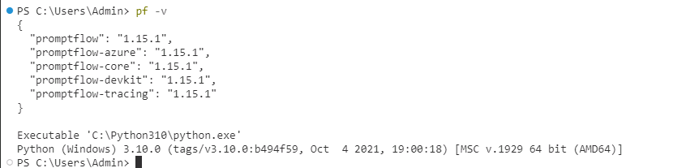

# Task 09 - Install the Prompt flow for VS Code extension

<!--- Estimated time: 5 minutes---> 

## Introduction

Later in this lab, you’ll use the Prompt flow tool in Azure AI Studio to create a chatbot. Visitors to the Contoso Hotels website will use the chatbot to ask questions and find their ideal hotel.

Visual Studio Code provides a Prompt flow extension to help streamline the development of AI applications. 

## Description

In this task, you will install the Prompt flow extension for Visual Studio Code. To install this extension, Visual Studio Code must be updated to the latest version and Python must be installed on your computer.

The key steps are as follows:

1. Use the pip install command to install promptflow, promptflow-tools, and promptflow-azure.
1. Verify that the tools are successfully installed.
1. Search for and install the Prompt flow for VS Code extension.

## Success Criteria

- You’ve successfully installed the Prompt flow for VS Code extension. 

## Learning Resources

- [**Pip Install**](https://python.land/virtual-environments/installing-packages-with-pip)
- [**Prompt flow for VS Code**](https://marketplace.visualstudio.com/items?itemName=prompt-flow.prompt-flow)

## Solution

<details markdown="block">
<summary>Expand this section to view the solution</summary>

1. In Visual Studio Code, select **Ctrl+Shift+X**  to open the **Visual Studio Code Extensions** pane.

1. In the **Extensions** pane **Search** field, enter **Prompt flow**.

1. In the search results, select **Prompt flow for VS Code** and then select **Install**. Wait while the extension installs.

   {: .warning }
   > You may see an error stating that the extension is not compatible with the version of Visual Studio Code that you’ve installed. If you see the error, follow the steps in Exercise 01 Task 02 to upgrade Visual Studio Code.

   {: .warning }
   > On some machines, pip does not properly install prompt flow tools. If this is the case, run the following four commands to install prompt flow using pipx instead of pip:

   > ```
   > uninstall promptflow: pip uninstall promptflow
   > python3 -m pip install --user pipx
   > python3 -m pipx ensurepath"
   > pipx install promptflow
   > ```

1. Enter the following command at the Visual Studio Code Terminal prompt. This command installs libraries that support Prompt flow.

    ```
    pip install promptflow promptflow-tools promptflow-azure
    ```

1. Enter the following command at the Visual Studio Code Terminal prompt. This command checks the installation.

    ```
    pf -v
    ```

   {: .note }
   > If the tools are correctly installed, version information for the tools displays in the Terminal window.

     

   {: .warning }
   > If you see an error message stating that "pf" is not recognized, close Visual Studio Code. Then, launch Visual Studio Code as an administrator and repeat the steps in this task.

1. Leave Visual Studio Code open. You’ll use the tool again in the next task.

</details>
