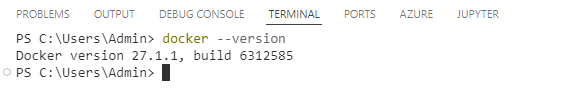
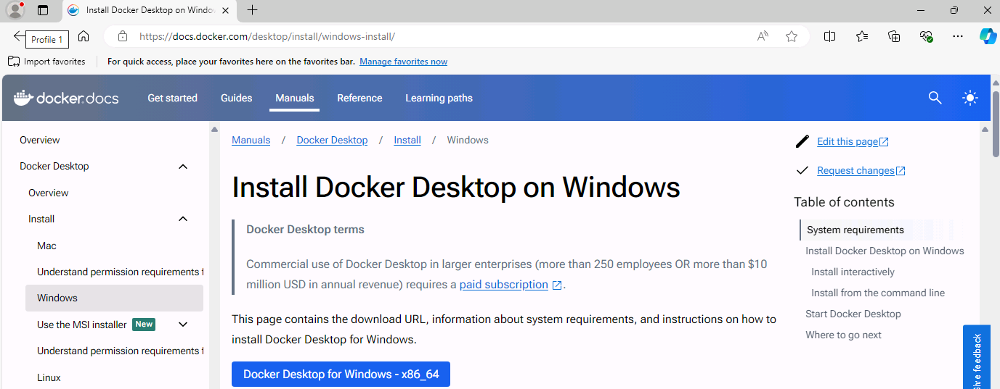

# Task 10 - Install Docker Desktop

<!--- Estimated time: 7 minutes---> 

## Introduction

Docker is an open-source platform designed to automate the deployment, scaling, and management of applications using containerization. Containers are lightweight, standalone, and executable packages that include everything needed to run a piece of software, such as the code, runtime, system tools, libraries, and settings. As part of the lab, you’ll deploy app components to Docker containers. 

## Description

In this task, you’ll ensure that Docker Desktop is installed and install Docker Desktop if needed.

The key steps are as follows:

1. Run a command to determine whether Docker is installed.
1. Install Docker if necessary.
1. Verify that Docker is correctly installed.

## Success Criteria

- You’ve successfully installed Docker Desktop. 

## Learning Resources

- [**What is Docker**](https://learn.microsoft.com/en-us/dotnet/architecture/microservices/container-docker-introduction/docker-defined)

## Solution

<details markdown="block">
<summary>Expand this section to view the solution</summary>

1. Enter the following command at the Visual Studio Code Terminal window prompt. This command returns the Docker version if Docker is installed. 

    ```
    docker --version
    ```

    

   {: .warning }
   > If Docker is installed, skip the remaining steps in this task and move to the next exercise. Otherwise, complete the following steps to install Docker.

1. Open a web browser and go to  [**Install Docker Desktop on Windows**](https://docs.docker.com/desktop/install/windows-install). 

    

1. Select **Docker Desktop for Windows - x86_64**. The  installer should start downloading immediately.

1. When the download completes, select **Open file**.

1. If a **User Account Control** dialog displays, select **Yes**.

1. Follow the prompts to install Docker Desktop. 

   {: .note }
   > You may need to restart your machine as part of the Docker Desktop installation process.

1. In the **Python Setup** dialog, select **Close**.
    
1. Return to Visual Studio Code. Enter the following command at the Terminal window prompt and then select **Enter**. Verify that the command returns the Docker version. 

    ```
    docker --version
    ```

1. Leave Visual Studio Code open. You’ll use the tool in the next exercise.

</details>
