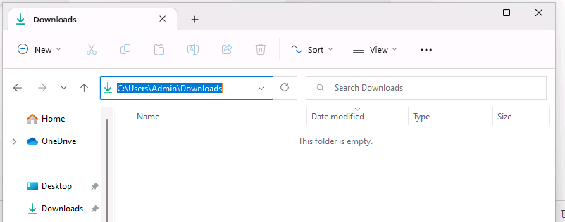
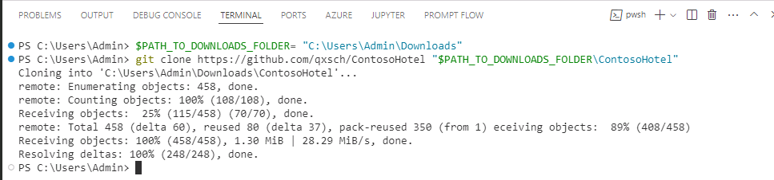
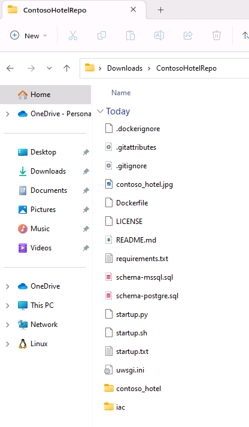

# Task 01 - Clone the GitHub repository for the project to your local machine

<!--- Estimated time: 3 minutes---> 

## Introduction

The Contoso Hotel app is monolithic. Front-end components (HTML, CSS, and JavaScript files) and back-end components (APIs) are all deployed as a single unit. The files required to deploy the legacy app are stored in a GitHub repository. 

## Description

In this task, you’ll clone the GitHub repository to the **Downloads** folder on your local machine. 

The key steps are as follows:

1. Clone the GitHub repository for the project to the **Downloads\ContosoHotel** folder.
2. Verify that the files are present on your local machine.

## Success Criteria

- The files for the legacy app are available in the **Downloads\ContosoHotel** folder on your machine.

## Learning Resources

- [**Collaborate with Git**](https://learn.microsoft.com/en-us/training/modules/collaborate-with-git/ "Collaborate with Git.")

## Solution

<details markdown="block">
<summary>Expand this section to view the solution</summary>

1.  Open File Explorer on your computer and go to the **Downloads** folder. 

    

1. Modify the value of the following variable to reflect the path to the **Downloads** folder on your computer. Enter the command at the Visual Studio Code Terminal window prompt and select **Enter** to set your **Downloads** folder path as a variable.

    ```
    $PATH_TO_DOWNLOADS_FOLDER = "C:\Users\Admin\Downloads"
    ```

1. Enter the command at the Visual Studio Code Terminal window prompt and then select **Enter** to clone the GitHub repository to the **Downloads\ContosoHotel** folder on your computer. 

    ```
    git clone https://github.com/qxsch/ContosoHotel "$PATH_TO_DOWNLOADS_FOLDER\ContosoHotel"
    ```

    

1. Open File Explorer and go to your **Downloads** folder. Verify that the ContosoHotel folder and files are present.

    

1. Leave Visual Studio Code open. You’ll use the tool in the next task.

</details>
