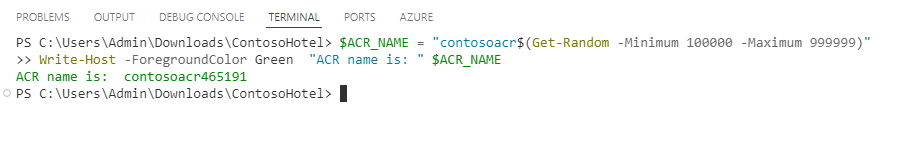
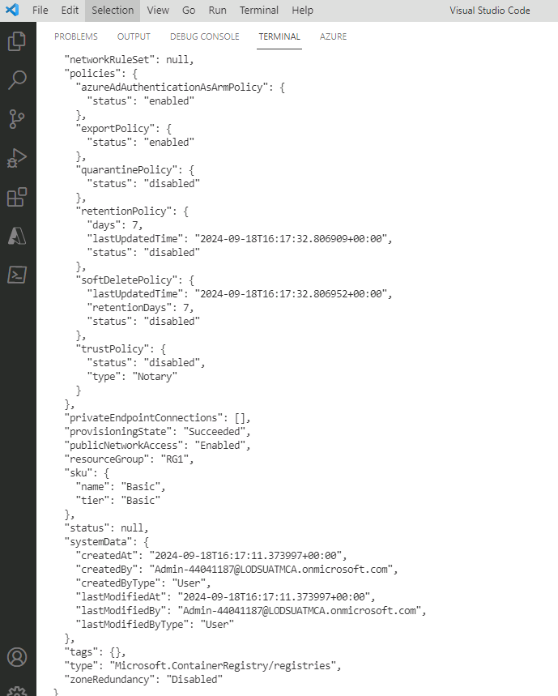
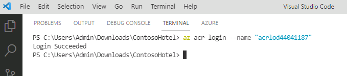
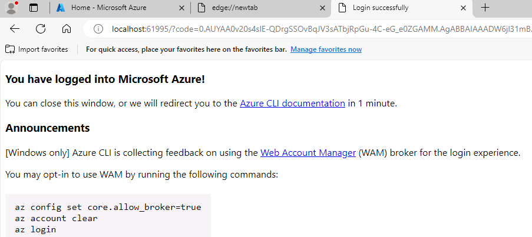
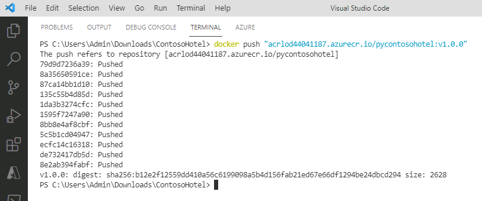

# Task 03 - Create an Azure Container Registry (ACR) instance and push the app container to ACR

<!--- Estimated time: 10 minutes---> 

## Introduction

Azure Container Registry (ACR) is a managed, private Docker registry service provided by Microsoft Azure. It allows you to store and manage container images and artifacts in a secure and scalable manner. 

## Description

In this task, you’ll create an Azure Container Registry instance.

The key steps are as follows:

1. Create an Azure Container Registry instance. 
1. Sign in to ACR and push the app container that you created in the previous task to ACR.

## Success Criteria

- You’ve pushed the app container to ACR. 

## Learning Resources

- [**Manage container images in Azure Container Registry**](https://learn.microsoft.com/en-us/training/modules/publish-container-image-to-azure-container-registry/)

## Solution

<details markdown="block">
<summary>Expand this section to view the solution</summary>


1. Enter the following command at the Terminal window prompt and then select **Enter**.

    ```
    az login
    ```

    

1. Enter the following command at the Terminal window prompt and then select **Enter**. This command generates a unique name for the ACR instance.

    ```
    $ACR_NAME = "contosoacr$(Get-Random -Minimum 100000 -Maximum 999999)"
    Write-Host -ForegroundColor Green  "ACR name is: " $ACR_NAME
    ```

    

1. Enter the following command at the Terminal window prompt and then select **Enter**. This command creates an ACR instance.

    ```
    az acr create --resource-group "ContosoHotel" --name "$ACR_NAME" --sku Basic --admin-enabled true
    ```

    

   {: .warning }
   > Record the ACR name. You’ll need to supply the ACR name again later in the lab.


1. Enter the following command at the Terminal window prompt and then select **Enter**. This command signs you in to the ACR instance.

    ```
    az acr login --name "$ACR_NAME"
    ```

    

1. When a message displays stating that you’ve logged into Microsoft Azure, close the web page and return to Visual Studio Code.

    

   {: .warning }
   > You may see an error message stating the Azure could not connect to the registry login server. This error usually indicates that even though the container registry instance is provisioned, there’s still some configuration happening. Wait a few minutes and run the command again.

1. Enter the following command at the Terminal window prompt and then select **Enter**. This command creates a Docker tag for the app.

    ```
    docker tag "pycontosohotel:v1.0.0" "$ACR_NAME.azurecr.io/pycontosohotel:v1.0.0"
    ```

1. Enter the following command at the Terminal window prompt and then select **Enter**. This command pushes the app container to ACR.

    ```
    docker push "$ACR_NAME.azurecr.io/pycontosohotel:v1.0.0"
    ```

    

   {: .note }
   > It may take 1-2 minutes to push the app container to ACR.

1. Leave Visual Studio Code open. You’ll use the tool in the next task.
