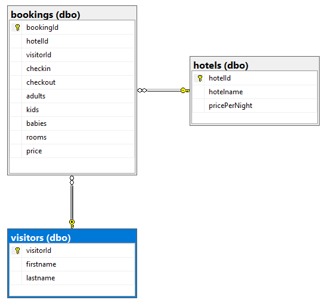
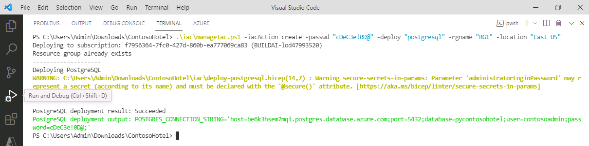

# Task 04 - Provision a PostgreSQL database to support the app

<!--- Estimated time: 10 minutes---> 

## Introduction

The Contoso Hotel legacy app stores data in a PostgreSQL database. PostgreSQL is a powerful, open-source relational database management system (RDBMS). It’s known for its robustness, extensibility, and standards compliance. Azure Database for PostgreSQL Flexible Server is a fully managed database service designed to provide more granular control and flexibility over database management functions and configuration settings. 

The database uses the following schema:



## Description

In this task, you’ll provision an Azure Database for PostgreSQL Flexible Server instance. 

The key steps are as follows:

1. Run the Connect-AzAccount cmdlet to connect Visual Studio Code to Azure with an authenticated account. 
1. Run the **manageIac.ps1** script from the **ContosoHotel\iac** folder to deploy an Azure Database for PostgreSQL Flexible Server instance. 

## Success Criteria

- You’ve provisioned an Azure Database for PostgreSQL Flexible Server instance. 

## Learning Resources

- [**Connect-AzAccount**](https://learn.microsoft.com/en-us/powershell/module/az.accounts/connect-azaccount?view=azps-12.3.0)
- [**Explore PostgreSQL architecture**](https://learn.microsoft.com/en-us/training/modules/explore-postgresql-architecture/ )

## Solution

<details markdown="block">
<summary>Expand this section to view the solution</summary>

In this task, you’ll provision a PostgreSQL database in Azure to support the app. You’ll use the same database to support the enhanced application that you build later in this lab.

1. Enter the following command at the Visual Studio Code Terminal window prompt. This command connects the Terminal window with your Azure subscription so that you deploy Azure resources to the correct subscription.

    ```
    Connect-AzAccount
    ```
    
1. On the **Let's get you signed in** page, select **Work or School account** and then select **Continue**. Sign in using your Azure credentials.

1. On the **Stay signed in to all your apps** page, select **OK** and then select **Done**. You are returned to Visual Studio Code. Information displays about available subscriptions. Select the subscription that you wish to use.

1. Replace the text REPLACE_WITH_REGION_YOU_SELECTED_IN_EX01_TASK01 in the following command with the Azure region location that you selected earlier in the lab. Enter the command at the Terminal window prompt and then select **Enter**. This command deploys a PostgreSQL server instance. 

    ```
    .\iac\manageIac.ps1 -iacAction create -passwd "1234ABcd!" -deploy "postgresql" -rgname "ContosoHotel" -location "REPLACE_WITH_REGION_YOU_SELECTED_IN_EX01_TASK01"
    ```

   {: .note }
   > The script first checks for common errors and then provisions the database. It may take 6-10 minutes to deploy the PostgreSQL server instance. You may see several warnings display during deployment. 

   {: .warning }
   > You may see an error stating that Bicep is not found. If this error is displayed, repeat the steps in Exercise 01 Task 06 and then run the command again.

1. When the deployment completes, the Terminal window will display a message in green font that shows the connection string for the database. 

      

   {: .warning }
   > If you do not see a message after 10 minutes stating that the PostgreSQL server and database are deployed successfully, go to the Azure portal and select your resource group. Look for a PostgreSQL server and database in the list of resources. Check the Overview section of the resource group to see if there are deployments in progress.
   > Notify your coach about any issues. 

1. The *POSTGRES_CONNECTION_STRING* should resemble the following. Record the connection string for use later in the lab: 

    ```
    host=53pkyjrx5j7ve.postgres.database.azure.com;port=5432;database=pycontosohotel;user=contosoadmin;password=1234ABcd!;
    ```
   
1. Leave Visual Studio Code open. You’ll use the tool in the next task.

</details>
