# Exercise 02 - Deploy and review the legacy Contoso Hotel app

### Lab Scenario

The legacy Contoso Hotel app was written by using Python code. App components run inside a Docker container. The app can connect to a SQL Server or PostgreSQL database (on-premises or online). 

In this exercise, you will deploy the legacy app to a Docker container and then run the container. You will provision a PostgreSQL database instance on Azure. You will setup and review the app, and then test the app by adding a new booking.

### Objectives

After you complete this lab, you will be able to:

- Clone a GitHub repository to your local machine
- Build a Docker container for app components
- Create an Azure Container Registry (ACR) instance to store Docker containers
- Push the Docker container for the app to ACR
- Provision a PostgreSQL database in Azure to support the app
- Run the containerized app and populate the database
- Review the legacy Contoso Hotel app and add a booking

### Exercise Duration

Estimated time to complete this exercise: *45 minutes*


## Task 01 - Clone the GitHub repository for the project to your local machine

<!--- Estimated time: 3 minutes---> 

### Introduction

The Contoso Hotel app is monolithic. Front-end components (HTML, CSS, and JavaScript files) and back-end components (APIs) are all deployed as a single unit. The files required to deploy the legacy app are stored in a GitHub repository. 

### Description

In this task, you will clone the GitHub repository to the Downloads folder on your local machine. 

The key steps are as follows:

1. Clone the GitHub repository for the project to the Downloads\ContosoHotel folder.
2. Verify that the files are present on your local machine.

### Success Criteria

- The files for the legacy app are available in the Downloads\ContosoHotel folder on your machine

### Learning Resources

- [**Collaborate with Git**](https://learn.microsoft.com/en-us/training/modules/collaborate-with-git/ "Collaborate with Git.")

### Solution

<details markdown="block">
<summary>Expand this section to view the solution</summary>

1.   Open File Explorer on your computer and go to the Downloads folder. 

    

1.  Input the following into the Visual Studio Code Terminal and press **Enter** to set your Downloads folder path as a variable.

    ```
    $PATH_TO_DOWNLOADS_FOLDER = "C:\Users\Admin\Downloads"
    ```

1.  Enter the command at the Visual Studio Code Terminal window prompt and then press the **Enter** key to clone the GitHub repository to the Downloads\ContosoHotel folder on your computer. 

    ```
    git clone https://github.com/qxsch/ContosoHotel "$PATH_TO_DOWNLOADS_FOLDER\ContosoHotel"
    ```

    

1.  Open File Explorer and go to your Downloads folder. Verify that the ContosoHotel folder and files are present.

    

1.  Leave Visual Studio Code open. You will use the tool in the next task.

</details>


## Task 02: Build a Docker container for the app

<!--- Estimated time: 7 minutes---> 

### Introduction

You will run the legacy Contoso Hotel app in a Docker container. Docker is an open-source platform that automates the deployment, scaling, and management of applications. It uses containerization technology to package an application and its dependencies into a container, ensuring that it runs consistently across different environments.

### Description

In this task you create the Docker container and add app components to the container.

The key steps are as follows:

1. Launch Docker Desktop 
1. Verify that the Docker engine is running
1. Build a Docker container for the app

### Success Criteria

- The Docker engine is running
- You have built a Docker container for the app

### Learning Resources

- [**Introduction to Docker containers**](https://learn.microsoft.com/en-us/training/modules/intro-to-docker-containers/ )
- [**Build a containerized web application with Docker**](https://learn.microsoft.com/en-us/training/modules/intro-to-containers/)

### Solution

<details markdown="block">
<summary>Expand this section to view the solution</summary>

1.  Open **Docker Desktop**. Wait for the app to start. After the app starts wait for the app to start Docker Engine.

    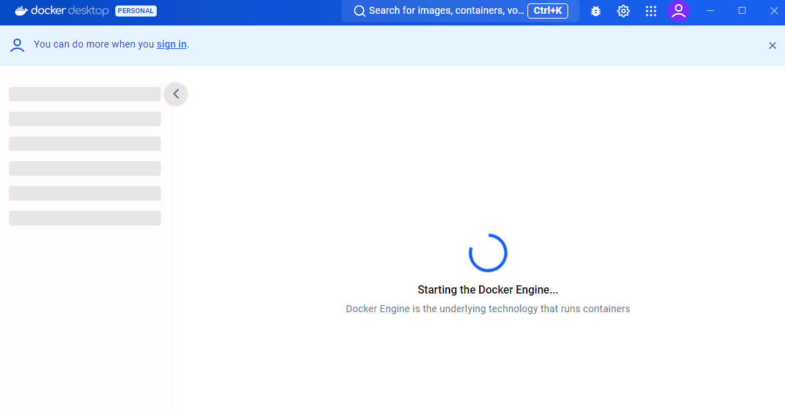

1.  Minimize Docker Desktop but do not close the app.

1.  Enter the following command at the Visual Studio Terminal window prompt and press the **Enter** key. This command allows you to run commands as an administrator.

    ```
    Start-Process powershell -Verb runAs
    ```

1.  In the User Account Control window that displays, select **Yes**. A PowerShell window opens.

    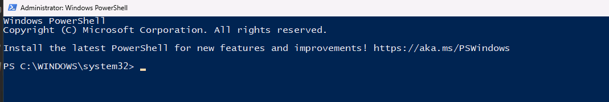

1.  Enter the following command at the PowerShell prompt and then press the **Enter** key. This command configures the Docker daemon to start automatically.

    ```
    Set-Service -Name com.docker.service -StartupType Automatic
    ```

    >{: .important } The Set-Service command will fail if you are not running PowerShell as an administrator.

1.  Enter the following command at the PowerShell prompt and then press the **Enter** key. This command manually starts the Docker daemon.

    ```
    Start-Service -Name com.docker.service
    ```

    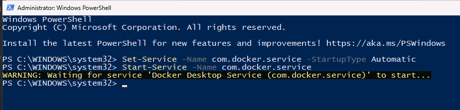

1.  Enter the following command at the PowerShell prompt and then press the **Enter** key. This command checks the status of the Docker daemon. Verify that the results show the Docker daeomon is running.

    ```
    Get-Service -Name com.docker.service
    ```

    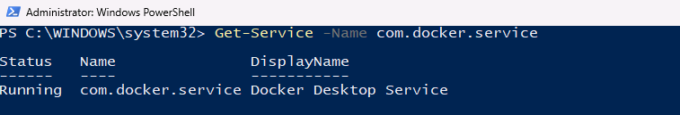

1.  Minimize the PowerShell window. Return to Visual Studio Code.

1.  Modify the file path, if needed, for the following command to point to Downloads\ContosoHotel folder that you created. Enter the command at the Visual Studio Code Terminal window and then press the **Enter** key. This command switches the context to the folder where the cloned repository resides.

    ```
    cd $PATH_TO_DOWNLOADS_FOLDER\ContosoHotel
    ```

    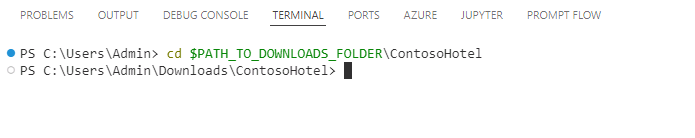

1.  Enter the following command at the Terminal window prompt and then press the **Enter** key. This command builds the container for the app. Wait while the container builds.

    ```
    docker build -t "pycontosohotel:v1.0.0" .
    ```

    

    >{: .note }It may take 2-3 minutes to build the container.

1.  Leave Visual Studio Code open. You will use the tool in the next task.

</details>


## Task 03: Create an Azure Container Registry (ACR) instance and push the app container to ACR

<!--- Estimated time: 10 minutes---> 

### Introduction

Azure Container Registry (ACR) is a managed, private Docker registry service provided by Microsoft Azure. It allows you to store and manage container s and artifacts in a secure and scalable manner. 

### Description

In this task, you will create an Azure Container Registry instance.

The key steps are as follows:

1. Create an Azure Container Registry instance. 
1. Sign in to ACR and push the app container that you created in the previous task to ACR.

### Success Criteria

- You have pushed the app container to ACR. 

### Learning Resources

- [**Manage container s in Azure Container Registry**](https://learn.microsoft.com/en-us/training/modules/publish-container--to-azure-container-registry/)

### Solution

<details markdown="block">
<summary>Expand this section to view the solution</summary>

1.  Enter the following command at the Visual Studio Code Terminal window prompt and then press the **Enter** key. The Terminal window will display a device code. 

    ```
    Connect-AzAccount  -DeviceCode
    ```

1.  **Ctrl+Click** the link to navigate to [**Device Login**](https://microsoft.com/devicelogin/) in your browser. Enter the **device code** and follow the instructions to sign in.

    

1.  Enter the device code and then select **Next**. Select your account and then select **Next**.

1.  On the *Are you trying to sign in to Microsoft Azure PowerShell page*, select **Continue**.

    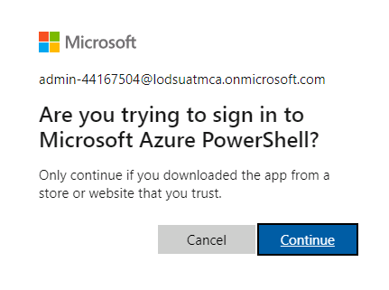

1.  Close the web page and return to Visual Studio Code. 

1.  If prompted, select the subscription you wish to use. You should use the same subscription where you created the resource group in Exercise 01 Task 01.

1.  Enter the following command at the Terminal Window prompt and then press the **Enter** key. This command generates a unique name for the ACR instance.

    ```
    $ACR_NAME = "contosoacr$(Get-Random -Minimum 100000 -Maximum 999999)"
    Write-Host -ForegroundColor Green  "ACR name is: " $ACR_NAME
    ```

    >{: .note } Record the ACR name. You will need to supply the ACR name again in a future Exercise.

1.  Enter the following command at the Terminal Window prompt and then press the **Enter** key.

    ```
    az login
    ```

    

1.  Enter the following command at the Terminal Window prompt and then press the **Enter** key. This command creates an ACR instance.

    ```
    az acr create --resource-group "ContosoHotel" --name "$ACR_NAME" --sku Basic --admin-enabled true
    ```

    


1.  Enter the following command at the Terminal Window prompt and then press the **Enter** key. This command signs you in to the ACR instance.

    ```
    az acr login --name "$ACR_NAME"
    ```

    

    >{: .important } You may see an error message stating the Azure could not connect to the registry login server. This error usually indicates that even though the container registry instance is provisioned there is still some configuration happening. Wait a few minutes and run the command again.

1.  Enter the following command at the Terminal Window prompt and then press the **Enter** key. This command creates a Docker tag for the app.

    ```
    docker tag "pycontosohotel:v1.0.0" "$ACR_NAME.azurecr.io/pycontosohotel:v1.0.0"
    ```

1.  Enter the following command at the Terminal Window prompt and then press the **Enter** key. This command pushes the app container to ACR.

    ```
    docker push "$ACR_NAME.azurecr.io/pycontosohotel:v1.0.0"
    ```

    

    >{: .note } It may take 1-2 minutes to push the app container to ACR.

1.  Leave Visual Studio Code open. You will use the tool in the next task.


## Task 04: Provision a PostgreSQL database to support the app

<!--- Estimated time: 10 minutes---> 

### Introduction

The Contoso Hotel legacy app stores data in a PostgreSQL database. PostgreSQL is a powerful, open-source relational database management system (RDBMS). It is known for its robustness, extensibility, and standards compliance. Azure Database for PostgreSQL Flexible Server is a fully managed database service designed to provide more granular control and flexibility over database management functions and configuration settings. 

 The database uses the following schema:


### Description

In this task, you will provision a Azure Database for PostgreSQL flexible server instance. 

The key steps are as follows:

1. Run the  Connect-AzAccount cmdlet to connect Visual Studio Code to Azure with an authenticated account. 
1. Run the `manageIac.ps1` script from the `ContosoHotel\iac` folder to deploy an Azure Database for PostgreSQL Flexible Server instance. 

### Success Criteria

- You have provisioned an Azure Database for PostgreSQL Flexible Server instance. 

### Learning Resources

- [**Connect-AzAccount**](https://learn.microsoft.com/en-us/powershell/module/az.accounts/connect-azaccount?view=azps-12.3.0)
- [**Explore PostgreSQL architecture**](https://learn.microsoft.com/en-us/training/modules/explore-postgresql-architecture/ )

### Solution

<details markdown="block">
<summary>Expand this section to view the solution</summary>

 In this task, you will provision a PostgreSQL database in Azure to support the app.

1.  Replace the text *<ReplaceWithTheAzureRegionYouSelected>* in the following command with the Azure region location that you selected earlier in the lab. Enter the command at the Terminal window prompt and then press the **Enter** key. This command deploys a PostgreSQL server instance. 

    ```
    .\iac\manageIac.ps1 -iacAction create -passwd "myLittleSecret111!!!" -deploy "postgresql" -rgname "ContosoHotel" -location "<ReplaceWithTheAzureRegionYouSelected>"
    ```

    >{: .note }
    >
    >The script first checks for common errors and then provisions the database. </br></br>It may take 6-10 minutes to deploy the PostgreSQL server instance. You may see several warnings display during deployment. 

    >{: .important }
    >
    >You may see an error stating that Bicep is not find. If this error displays, repeat the steps in Exercise 01 Task 06 and then run the command again.

1.  When the deployment completes, the Terminal window will display a message in green font that shows the connection string for the database. 

       

1.  The connection string should resemble the following string. Record the connection string for use later in the lab: </br></br>host=53pkyjrx5j7ve.postgres.database.azure.com;
    port=5432;database=pycontosohotel;user=contosoadmin;password=@lab.CloudPortalCredential(Admin).Password; 
   
1.  Leave Visual Studio Code open. You will use the tool in the next task.

</details>


## Task 05: Run the containerized app and add a booking

<!--- Estimated time: 5 minutes---> 

### Introduction
You created a Docker container and pushed the container to ACR in previous tasks. Now, you will run the container and view the app in a browser. Since this is the first time you are running the app, you will need to run a process to create the database schema and populate the tables with data.

Now, you can view the various pages for the app and try out the features.
 

### Description

In this task, you will run the Docker app container and then display the setup page for the app. You will  create the database schema and populate the tables with data. You will review common app pages and add a booking record. Finally, you will search for the record you just added to verify that the record was successfully added to the database.

The key steps are as follows:

1. Run the Docker container on port 8000.
1. Open the app at http://localhost:8000/setup.
1. Run the setup process in the app to add records to the database.
1. Review the app pages.
1. Add the following booking record:

    | Field | Value |
    |:---------|:---------|
    | Hotel   | **Contoso Suites Athens**  |
    | Visitor   | **Emma Davis**|
    | Check-in   | **12/28/2024**|
    | Check-out   | **01/05/2025**|
    | Adults   | **2**|
    | Rooms   | **1**|

1. Verify that the new record is saved and close the browser window.

### Success Criteria

- You can view the app in a web browser.
- You can add a booking record to the app and verify that the record is saved and is searchable.

### Learning Resources

[**Manage container s in Azure Container Registry.**](
https://learn.microsoft.com/en-us/training/modules/publish-container--to-azure-container-registry/ "Manage container s in Azure Container Registry")

### Solution

<details markdown="block">
<summary>Expand this section to view the solution</summary>

1.  Replace the *EnterConnectionStringForDatabase* placeholder text in the following command with the connection string you recorded in the previous task. Enter the command at the Visual Studio Code Terminal window prompt and then press the **Enter** key. This command starts the containerized app.

    ```
    docker run -p 8000:8000 -e POSTGRES_CONNECTION_STRING="EnterConnectionStringForDatabase" pycontosohotel:v1.0.0
    ```
    
    
    
    >{: .important } Do not close the Visual Studio Code Terminal window at this time.

1.  Open a web browser and go to **http://localhost:8000/setup**. The Contoso Hotel Setup page displays.

    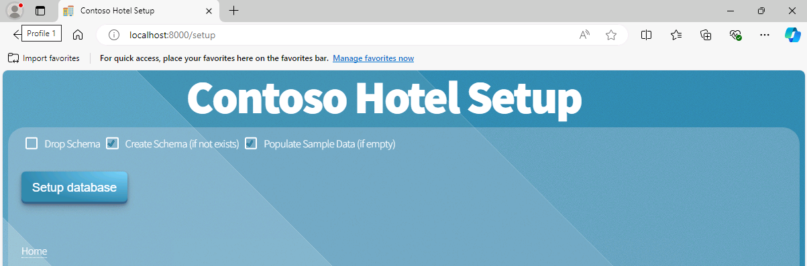

1.  On the Contoso Hotel Setup page, select **Setup database**. This launches a script that creates the database schema and populates the tables with data.

    >{: .note } The page updates when the script completes.

    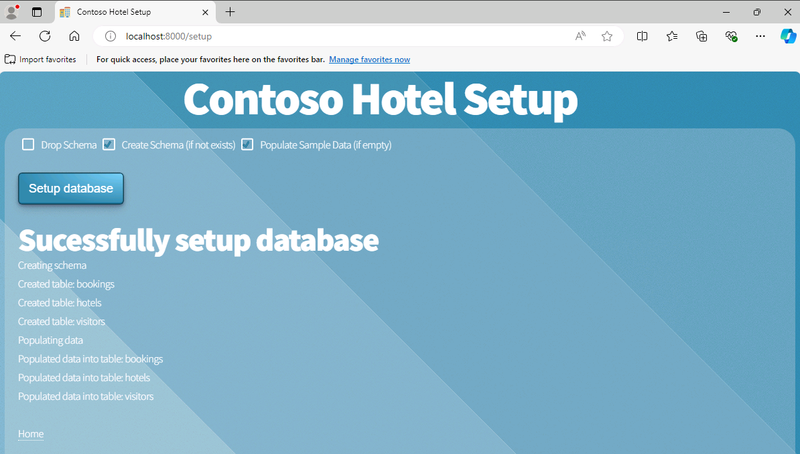 

1.  On the Contoso Hotel Setup page, select **Home**. The home page for the app displays.

1.  On the Home page, select the calendar icon to go to the Bookings page.

    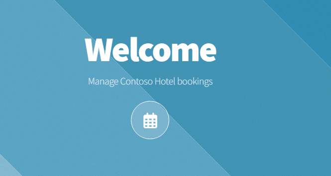

1.  On the Bookings page, select **New Booking**.

    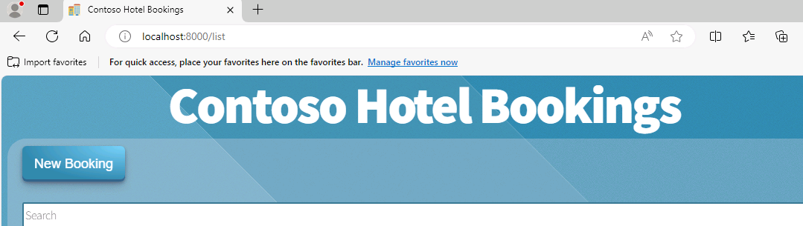

1.  Enter the following information into the page and then select **Add Booking**. The page will update to show you that the booking is successfully created.

    | Field | Value |
    |:---------|:---------|
    | Hotel   | **Contoso Suites Athens**   |
    | Visitor   | **Emma Davis**|
    | Check-in   | **12/28/2024**|
    | Check-out   | **01/05/2025**|
    | Adults   | **2**|
    | Rooms   | **1**|

    >{: .important }The Visitor field doesn't search properly. Type in the letter 'a' into the field and select a name from the dropdown.

    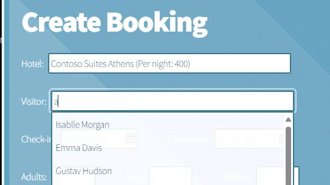

    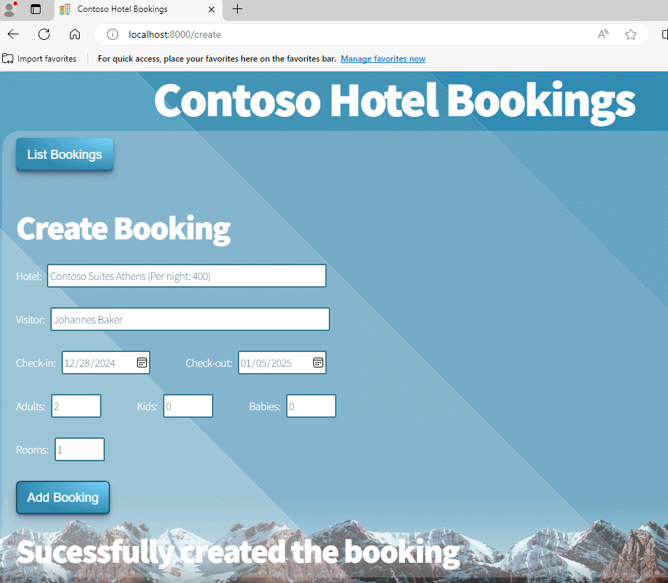

1.  On the Bookings page, select **List Bookings**.

1.  Enter **Emma Davis**, or whichever Visitor you selected, in the Search field. The booking that you created should appear in the list of bookings.

    

1.  Close the browser window.

1.  In Visual Studio Code, press the **Ctrl+C** keyboard combination from the Terminal pane to exit the running worker processes.

1.  Leave Visual Studio Code open. You will use the toool again in the next exercise.

</details>
