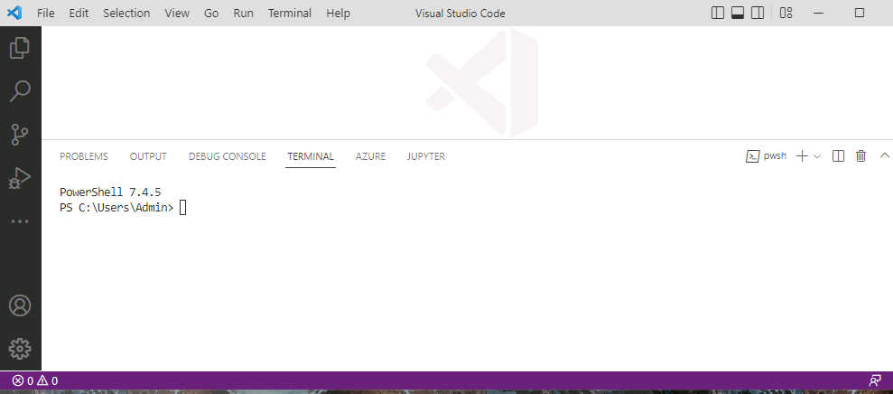
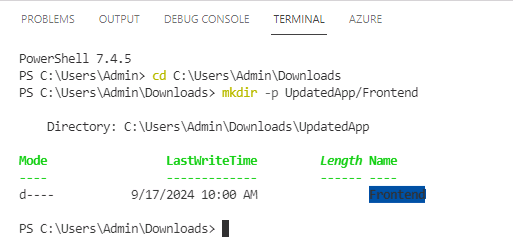
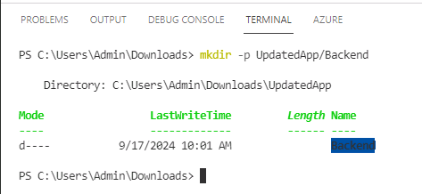
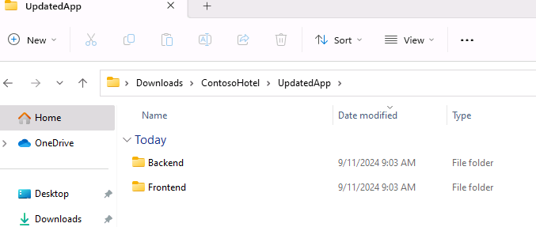
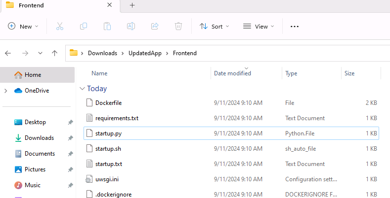
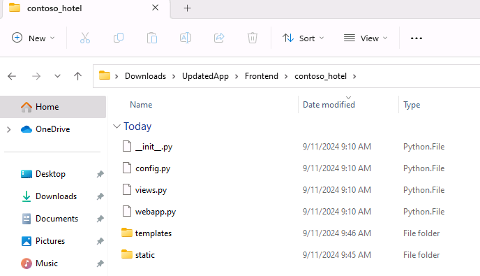
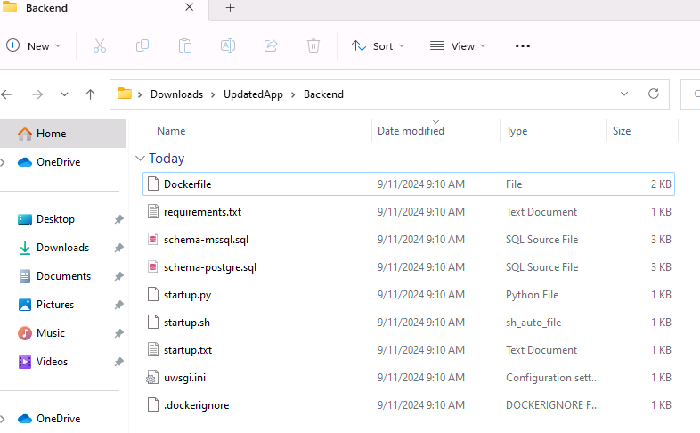
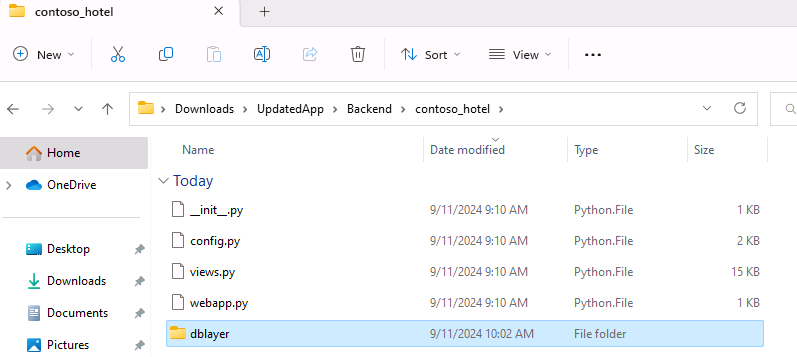

# Task 01 - Separate front-end components from back-end components

<!--- Estimated time: 15 minutes---> 

## Introduction

The Contoso Hotel legacy app is monolithic. That is, front-end components and back-end components are deployed as a single unit. Mololithic apps don’t scale very well. Contoso wants to ensure that the app scales to meet expected increases in demand.

Microsoft AppCAT (Application and Code Assessment Tool) is part of the Azure Migrate suite. The AppCAT tool assesses applications and code and identifies dependencies and linkages. At this time, AppCAT only supports .NET and Java apps. Python is not supported.

## Description

In this task, you’ll manually separate front-end and back-end components into separate folders.

The key steps are as follows:

1. Create a folder named **UpdatedApp** with subfolders **FrontEnd** and **Backend**.
1. Copy all front-end files to the **FrontEnd** folder and all back-end files to the **Backend** folder.

## Success Criteria

- You’ve created the **UpdatedApp** folder and the **FrontEnd** and **Backend** subfolders. 
- You’ve copied the required files to the **FrontEnd** and **Backend** subfolders.


## Learning Resources

- [**Decompose a monolithic application**](https://learn.microsoft.com/en-us/training/modules/microservices-architecture/ )
- [**Azure Migrate application and code assessment**](https://learn.microsoft.com/en-us/azure/migrate/appcat/overview )

## Solution

<details markdown="block">
<summary>Expand this section to view the solution</summary>

1. Open Visual Studio Code.

1. On the Visual Studio Code menu bar, select **Terminal** and then select **New Terminal**. A Terminal pane opens at the bottom of the window.

    

1. Update the value for the $PATH_TO_DOWNLOADS variable to point to the **Downloads** folder on your machine. Enter the following commands at the Terminal window prompt to set the variable and change directories to that folder, which contains the repository files you cloned in Exercise 01.

    ```
    $PATH_TO_DOWNLOADS = "C:\Users\Admin\Downloads\ContosoHotelRepo"
    cd $PATH_TO_DOWNLOADS
    ```

    

1. Enter the following command at the Terminal window prompt. This command creates a directory for front-end components.

    ```
    mkdir -p ContosoHotel/UpdatedApp/Frontend
    ```

    

1. Enter the following command at the Terminal window prompt. This command creates a directory for back-end components.

    ```
    mkdir -p ContosoHotel/UpdatedApp/Backend 
    ```

    

1. Open File Explorer and go to the **Downloads/ContosoHotel** folder. Verify that the **UpdatedApp** folder and subfolders you created are present.

    

1. Enter the following commands at the Terminal window prompt. These commands copy all necessary files to the **Frontend** folder for the updated app.

    ```
    cd $PATH_TO_DOWNLOADS\ContosoHotel
    cp startup.* $PATH_TO_DOWNLOADS\ContosoHotel\UpdatedApp\Frontend
    cp uwsgi.ini $PATH_TO_DOWNLOADS\ContosoHotel\UpdatedApp\Frontend
    cp Dockerfile $PATH_TO_DOWNLOADS\ContosoHotel\UpdatedApp\Frontend
    cp *.docker* $PATH_TO_DOWNLOADS\ContosoHotel\UpdatedApp\Frontend
    cp requirements.txt $PATH_TO_DOWNLOADS\ContosoHotel\UpdatedApp\Frontend
    ```
    

1. Enter the following commands at the Terminal window prompt. These commands create a subfolder in the **Frontend** folder and copy all necessary files to subfolder.

    ```
    cd $PATH_TO_DOWNLOADS

    cp -r ContosoHotel/contoso_hotel/static $PATH_TO_DOWNLOADS\ContosoHotel\UpdatedApp\Frontend\contoso_hotel\
    cp -r ContosoHotel/contoso_hotel/templates $PATH_TO_DOWNLOADSs\ContosoHotel\UpdatedApp\Frontend\contoso_hotel\
    cp ContosoHotel/contoso_hotel/*.py $PATH_TO_DOWNLOADS\ContosoHotel\UpdatedApp\Frontend\contoso_hotel\
    ```

    

1. Enter the following commands at the Terminal window prompt. These commands copy all necessary files to the **Backend** folder for the updated app.

    ```
    cd $PATH_TO_DOWNLOADS\ContosoHotel
    cp *.sql $PATH_TO_DOWNLOADS\ContosoHotel\UpdatedApp\Backend
    cp startup.* $PATH_TO_DOWNLOADS\ContosoHotel\UpdatedApp\Backend
    cp uwsgi.ini $PATH_TO_DOWNLOADS\ContosoHotel\UpdatedApp\Backend
    cp *docker* $PATH_TO_DOWNLOADS\ContosoHotel\UpdatedApp\Backend
    cp requirements.txt $PATH_TO_DOWNLOADS\ContosoHotel\UpdatedApp\Backend
    ```

    

1. Enter the following commands at the Terminal window prompt. These commands create a subfolder in the **Backend** folder and copy all necessary files to subfolder.

    ```
    cd $PATH_TO_DOWNLOADS\

    cp -r ContosoHotel/contoso_hotel/dblayer $PATH_TO_DOWNLOADS\ContosoHotel\UpdatedApp\Backend\contoso_hotel\
    cp ContosoHotel/contoso_hotel/*.py $PATH_TO_DOWNLOADS\ContosoHotel\UpdatedApp\Backend\contoso_hotel\
    ```

    

1. Leave Visual Studio Code open. You’ll use the tool again in the next task.

</details>
