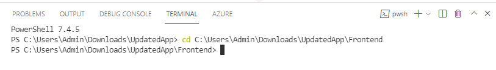
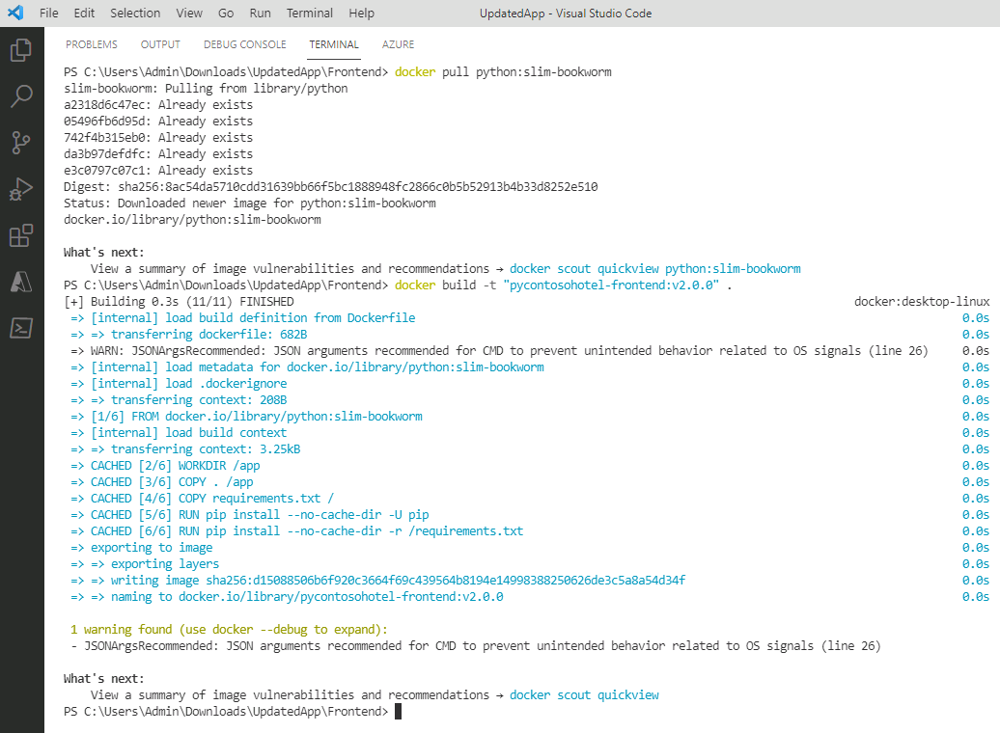
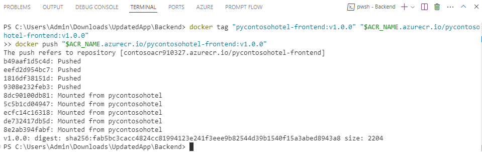
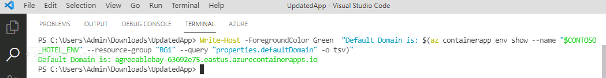
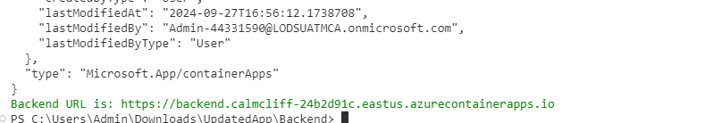

# Task 03 - Build the containers for front-end and back-end components and push the containers to Azure

<!--- Estimated time: 20 minutes---> 

## Introduction

You ran the legacy ContosoHotel app as a single Docker container. You’ve split up the front-end and back-end components into separate folders. Now, it’s time to build separate containers for front-end and back-end components and push the containers to ACR.


## Description

In this task, you’ll build separate containers for front-end and back-end components.

The key steps are as follows:

1. Build separate containers for front-end and back-end application components.
1. Run the `az containerapp env create` cmdlet to create an ACR environment for the app.
1. Create container apps for front-end and back-end components.
1. Run the `az containerapp ingress cors` command to manage Cross-Origin Resource Sharing (CORS) policies for the container apps.

## Success Criteria

- You’ve created Docker containers for front-end and back-end application components.
- You’ve created an ACR environment and container apps.
- You’ve configured CORS policies. 

## Learning Resources

- [**az containerapp create**](https://learn.microsoft.com/en-us/cli/azure/containerapp?view=azure-cli-latest#az-containerapp-create )
- [**az containerapp env**](https://learn.microsoft.com/en-us/cli/azure/containerapp/env?view=azure-cli-latest )
- [**az containerapp ingress cors**](https://learn.microsoft.com/en-us/cli/azure/containerapp/ingress/cors?view=azure-cli-latest )


## Solution

<details markdown="block">
<summary>Expand this section to view the solution</summary>

In this task you’ll build a Docker container for the updated app front-end components.

1. In the list of resources, locate the Container Registry instance. Select **Terminal** from the top menu and select **New Terminal**. Update the following variable to use the name of the instance that you recorded in Exercise 02 Task 03.

    ```
    $ACR_NAME="ACR_NAME_FROM_EX02_TASK03"
    ```

1. Update the value for the $PATH_TO_UPDATED_APP variable to point to the **Downloads\ContosoHotel\UpdatedApp** folder on your machine. Enter the following commands at the Terminal window prompt. These commands switch the context to the folder that contains the updated app components.

    ```
    $PATH_TO_UPDATED_APP = "C:\Users\ADMIN\Downloads\ContosoHotel\UpdatedApp"
    ```

1. In Visual Studio Code, enter the following command at the Terminal window prompt. This command ensures that you are working in the correct folder.

    ```
    cd  $PATH_TO_UPDATED_APP\Frontend
    ```

    

1. Enter the following command at the Terminal window prompt. This command builds the container for the front-end app components.

    ```
    docker pull python:slim-bookworm
    docker build -t "pycontosohotel-frontend:v1.0.0" .
    ```

   {: .note }
   > It may take 2-3 minutes to build the Docker container.

    

1. Enter the following commands at the Terminal window prompt. These commands tag the front-end container and push the container to ACR.

    ```
    docker tag "pycontosohotel-frontend:v1.0.0" "$ACR_NAME.azurecr.io/pycontosohotel-frontend:v1.0.0"
    docker push "$ACR_NAME.azurecr.io/pycontosohotel-frontend:v1.0.0"
    ```

    

1. Enter the following commands at the Terminal window prompt. These commands switch the context to the **Backend** folder and then build the Docker container for the back-end app components.

    ```
    cd  $PATH_TO_UPDATED_APP\Backend
    docker pull python:slim-bookworm
    docker build -t "pycontosohotel-backend:v1.0.0" .
    ```

   {: .note }
   > It may take 2-3 minutes to build the Docker container.

1. Enter the following commands at the Terminal window prompt. These commands tag the back-end container and push the container to ACR.

    ```
    docker tag "pycontosohotel-backend:v1.0.0" "$ACR_NAME.azurecr.io/pycontosohotel-backend:v1.0.0"
    docker push "$ACR_NAME.azurecr.io/pycontosohotel-backend:v1.0.0"
    ```

1. In Visual Studio Code, enter the following commands at the Terminal window prompt. These commands register app providers.

    ```
    az provider register --namespace Microsoft.App
    az provider register --namespace Microsoft.OperationalInsights
    ```

   {: .note }
   > It may take 2-3 minutes for these commands to complete.

1. Update the value of the **AZURE_REGION_FROM_EX01_TASK01** variable to use the region that you selected in Exercise 01 Task 01. Then, enter the command at the Terminal window prompt.

    ```
    $AZURE_REGION="AZURE_REGION_FROM_EX01_TASK01"
    ```

1. Enter the following commands at the Terminal window prompt. These commands create the container app environment.

    ```
    $CONTOSO_HOTEL_ENV = "contosoenv$(Get-Random -Minimum 100000 -Maximum 999999)"
    $CONTOSO_ACR_CREDENTIAL = az acr credential show --name $ACR_NAME --query "passwords[0].value" -o tsv
    az containerapp env create --name "$CONTOSO_HOTEL_ENV" --resource-group "ContosoHotel" --location "$AZURE_REGION"
    Write-Host -ForegroundColor Green  "Default Domain is: $(az containerapp env show --name "$CONTOSO_HOTEL_ENV" --resource-group "ContosoHotel" --query "properties.defaultDomain" -o tsv)"
    ```

   {: .note }
   > It may take 2-3 minutes for these commands to complete.

      

1. Replace the ENTER_CONNECTION_STRING_FROM_EX02_TASK04 placeholder text in the following command with the connection string you recorded in Exercise 02 Task 04. Enter the command at the Visual Studio Code Terminal window prompt and then select **Enter**. These commands create the container app for the back-end app components.

    ```
    az containerapp create --name "backend" --resource-group "ContosoHotel" --environment "$CONTOSO_HOTEL_ENV" --image "$ACR_NAME.azurecr.io/pycontosohotel-backend:v1.0.0" --target-port 8000 --ingress external --transport http --registry-server "$ACR_NAME.azurecr.io" --registry-username "$ACR_NAME" --registry-password "$CONTOSO_ACR_CREDENTIAL" --env-vars "POSTGRES_CONNECTION_STRING='ENTER_CONNECTION_STRING_FROM_EX02_TASK04'"
    $CONTOSO_BACKEND_URL = "https://$(az containerapp show --name "backend" --resource-group "ContosoHotel" --query 'properties.configuration.ingress.fqdn' -o tsv)"
    Write-Host -ForegroundColor Green  "Backend URL is: $CONTOSO_BACKEND_URL"
    ```

    

1. Enter the following commands at the Terminal window prompt. These commands create the container app for the front-end app components.

    ```
    az containerapp create --name "frontend" --resource-group "ContosoHotel" --environment "$CONTOSO_HOTEL_ENV" --image "$ACR_NAME.azurecr.io/pycontosohotel-frontend:v1.0.0" --target-port 8000 --ingress external --transport http --registry-server "$ACR_NAME.azurecr.io" --registry-username "$ACR_NAME" --registry-password "$CONTOSO_ACR_CREDENTIAL" --env-vars "API_BASEURL=$CONTOSO_BACKEND_URL"
    $CONTOSO_FRONTEND_URL = "https://$(az containerapp show --name "frontend" --resource-group "ContosoHotel" --query 'properties.configuration.ingress.fqdn' -o tsv)"
    Write-Host -ForegroundColor Green  "Frontend URL is: $CONTOSO_FRONTEND_URL"
    ```
     
  {: .warning }
  > Record the value for the front-end URL. You’ll use the value later in the lab.

1. Open a browser window and go to [**Azure portal**](https://portal.azure.com). Sign in to Azure if necessary.

1. Search for the **ContosoHotel** resource group and select the group.

1. Locate and select the **backend** container app.

1. In the left navigation pane for the container app, in the **Settings** section, select **CORS**.

1. In the **Allowed Origins** field, enter the value for the front-end URL that you recorded in Step 12 of this task. 

1. In the **Allowed Methods** field, enter an asterisk (*****). Select **Apply** to create the CORS policy.

1. Leave Visual Studio Code open. You’ll run additional commands in the next exercise.

</details>
