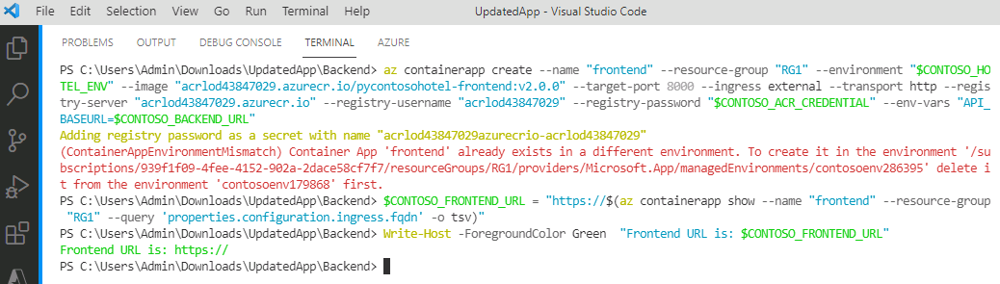

title: 'Exercise 03 - Split and repackage the Contoso Hotel app components and deploy the updated app'
layout: default
nav_order: 4
has_children: true

# Exercise 03 - Split and repackage the Contoso Hotel app components and deploy the updated app

To improve the scalability of the app, Contoso plans to split the front-end components (HTML, CSS, and JavaScript files) from back-end components (APIs). In this exercise you will split the components and refactor some code. Then, you will deploy the frontend and backend components to separate containers. Finally, you will push the containers to ACR and run the updated app. 

The updated app will use the following architecture:


## Objectives

After completing the tasks in this exercise, you will be able to:

- Separate front-end components from back-end components
- Refactor the front-end views.py file
- Refactor other front-end files
- Refactor the back-end views.py file
- Build the containers for front-end and back-end components
- Create the container apps in Azure
- Configure CORS in the backend source code

## Exercise Duration

Estimated time to complete this exercise: *60 minutes*


## Task 01 - Separate front-end components from back-end components

<!--- Estimated time: 15 minutes---> 

### Introduction

The Contoso Hotel legacy app is monolithic. That is, front-end components and back-end components are deployed as a single unit. Mololithic apps do not scale very well. Contoso wants to ensure that the app scales to meet expected increases in demand.

Microsoft AppCAT (Application and Code Assessment Tool) is part of the Azure Migrate suite. The AppCAT tool assesses applications and code and identifies depenencies and linkages. At this time, AppCAT only supports .NET and Java apps. Python is not supported.

### Description

In this task, you will manually separate frontend and backend components into separate folders.

The key steps are as follows:

1. Create a folder named UpdatedApp with subfolders FrontEnd and Backend.
1. Copy all front-end files to the FrontEnd folder and all back-end files to the Backend folder.

### Success Criteria

- You have created the UpdatedApp folder and the FrontEnd and Backend subfolders. 
- You have copied the required files to the FrontEnd and Backend subfolders.
- 

### Learning Resources

- [**Decompose a monolithic application**](https://learn.microsoft.com/en-us/training/modules/microservices-architecture/ )
- [**Azure Migrate application and code assessment**](https://learn.microsoft.com/en-us/azure/migrate/appcat/overview )

### Solution

<details markdown="block">
<summary>Expand this section to view the solution</summary>

1.  Open Visual Studio Code.

1.  On the Visual Studio Code menu bar, select **Terminal** and then select **New Terminal**. A Terminal pane opens at the bottom of the window.

    

1.  Update the value for the $PATH_TO_DOWNLOADS variable to point to the Downloads folder on your machine. Enter the following commands at the Terminal window prompt to set the variable and change directories to that folder, which contains the repository files you cloned in Exercise 01.

    ```
    $PATH_TO_DOWNLOADS = "C:\Users\Admin\Downloads"
    cd $PATH_TO_DOWNLOADS
    ```

    

1.  Enter the following command at the Terminal window prompt. This command creates a directory for front-end components.

    ```
    mkdir -p UpdatedApp/Frontend
    ```

    

1.  Enter the following command at the Terminal window prompt. This command creates a directory for back-end components.

    ```
    mkdir -p UpdatedApp/Backend 
    ```

    

1.  Open File Explorer and go to the Downloads\ContosoHotel folder. Verify that the folders you created are present.

    

1.  Enter the following commands at the Terminal window prompt. These commands copy all necessary files to the **Frontend** folder for the updated app.

    ```
    cd $PATH_TO_DOWNLOADS\ContosoHotel
    cp startup.* $PATH_TO_DOWNLOADS\UpdatedApp\Frontend
    cp uwsgi.ini $PATH_TO_DOWNLOADS\UpdatedApp\Frontend
    cp Dockerfile $PATH_TO_DOWNLOADS\UpdatedApp\Frontend
    cp *.docker* $PATH_TO_DOWNLOADS\UpdatedApp\Frontend
    cp requirements.txt $PATH_TO_DOWNLOADS\UpdatedApp\Frontend
    ```
    

1.  Enter the following commands at the Terminal window prompt. These commands create a subfolder in the **Frontend** folder and copy all necessary files to subfolder.

    ```
    cd $PATH_TO_DOWNLOADS

    cp -r ContosoHotel/contoso_hotel/static $PATH_TO_DOWNLOADS\UpdatedApp\Frontend\contoso_hotel\
    cp -r ContosoHotel/contoso_hotel/templates $PATH_TO_DOWNLOADSs\UpdatedApp\Frontend\contoso_hotel\
    cp ContosoHotel/contoso_hotel/*.py $PATH_TO_DOWNLOADS\UpdatedApp\Frontend\contoso_hotel\
    ```

    
1.  Enter the following commands at the Terminal window prompt. These commands copy all necessary files to the **Backend** folder for the updated app.

    ```
    cd $PATH_TO_DOWNLOADS\ContosoHotel
    cp *.sql $PATH_TO_DOWNLOADS\UpdatedApp\Backend
    cp startup.* $PATH_TO_DOWNLOADS\UpdatedApp\Backend
    cp uwsgi.ini $PATH_TO_DOWNLOADS\UpdatedApp\Backend
    cp *docker* $PATH_TO_DOWNLOADS\UpdatedApp\Backend
    cp requirements.txt $PATH_TO_DOWNLOADS\UpdatedApp\Backend
    ```

    

1.  Enter the following commands at the Terminal window prompt. These commands create a subfolder in the **Backend** folder and copy all necessary files to subfolder.

    ```
    cd $PATH_TO_DOWNLOADS\

    cp -r ContosoHotel/contoso_hotel/dblayer $PATH_TO_DOWNLOADS\UpdatedApp\Backend\contoso_hotel\
    cp ContosoHotel/contoso_hotel/*.py $PATH_TO_DOWNLOADS\UpdatedApp\Backend\contoso_hotel\
    ```

    

1.  Leave Visual Studio Code open. You will use the toool again in the next exercise.

</details>


## Task 02 - Refactor  files

<!--- Estimated time: 15 minutes---> 

### Introduction

The *views.py* file defines app routes, endopoints, and views. The file is divided into the following sections:

- Import statements
- Back-end API endpoints
- Front-end API endpoints

The *Dockerfile* file defines the Docker  to use and provides instructions for copying app components to the Docker container when you build the container. 

The *requirements.txt* file specifies the packages that the app requires to run. 

### Description

In the previous task, you added a copy of views.py to both the Fronted and Backend folders. You added the Dockerfile file and the requirements.txt file to the FrontEnd folder. In this task, you will modify all three files to remove references to back-end functionality. You will also modify the copy of views.py in the Backend folder to remove references to front-end functionality.

The key steps are as follows:

1. Open views.py from the FrontEnd folder in Visual Studio Code and remove the Backend API endpoints section.
1. Remove the dblayer reference from the views.py Imports section.
1. Remove the code from views.py that checks to see if the database is set up.
1. Update Dockerfile to remove the code that installs the MSSQL ODBC driver.
1. Update requirements.txt to remove references to the pyodbc and psycopg2-binary libraries.
1. Open views.py from the BacktEnd folder in Visual Studio Code and remove the Frontend API endpoints section.

### Success Criteria

- You have updated views.py, Dockerfile, and requirements.txt files in the FrontEnd folder and removed back-end code and references to data libraries. 
- You have updated views.py in the BackEnd folder and removed front-end code.

### Solution

<details markdown="block">
<summary>Expand this section to view the solution</summary>

In this task, you will refactor the front-end *views.py* file in the UpdatedApp\FrontEnd folder.


1.  In Visual Studio Code, press the **Ctrl** **Shift** **E** key combination to open the Explorer pane.

1.  In the Explorer pane, select **Open Folder**.

1.  In the Open Folder dialog, select the **Downloads** folder, select **UpdatedApp**, and the select **Select Folder**.

1.  In the *Do you trust the authors of the files in this folder?* dialog, select **Trust the authors of all files in the parent folder 'Downloads'** and then select **Yes, I trust the authors**. 

    

1.  In the Explorer pane, expand the **frontend** folder and then expand the **contoso_hotel** folder.

1.  Select **views.py**. The file displays in the right side of the Visual Studio Code window.

1.  Delete all code between the following region markers in the code (at or around lines 9 - 304):

    ```-nocopy
    #region -------- BACKEND API ENDPOINTS --------
    #endregion -------- BACKEND API ENDPOINTS -------- 
    ```  

    

1.  Locate the line of code that imports dblayer (at or around line 4). 

    

1.  Remove **dblayer,**.

    

    >{: .important } Do not forget to delete the comma after **dblayer**.

1.  Locate the code that checks to see if the database is set up (at or around lines 22-26):

    

1.  Delete the code that performs the database check.

    

1.  Save and close the file.

1.  In the Visual Studio Code Explorer pane, select **Dockerfile**. The file displays in the right side of the Visual Studio Code window.

    

1.  Locate the code that installs the mssql odbc driver (at or around lines 17-23):

    

1.  Delete the code hat installs the mssql odbc driver.

    

1.  Save and close the file.

1.  In the Visual Studio Code Explorer pane, select **requirements.txt**. The file displays in the right side of the Visual Studio Code window.

    

1.  Delete the pyodbc and psycopg2-binary libraries.

    

1.  Save and close the file.

1.  In the Explorer pane, expand the **backend** folder and then expand the **contoso_hotel** folder.

1.  Select **views.py**. The file displays in the right side of the Visual Studio Code window.

1.  Delete all code between the following region markers in the code (lines 309 - 332):

    ```
    #region -------- FRONTEND API ENDPOINTS --------
    #endregion -------- FRONTEND API ENDPOINTS -------- 
    ```  

    

1.  Save and close the file.

1.  Leave Visual Studio Code open. You will run addtional commands in the next task.


## Task 03 - Build the containers for front-end and back-end components and push the containers to Azure

<!--- Estimated time: 20 minutes---> 

### Introduction

You ran the legacy ContosoHotel app as a single Docker container. You have split up the front-end and back-end components into separate folders. Now, it is time to build separate containers for front-end and back-end components and push the containers to ACR.


### Description

In this task, you will 

The key steps are as follows:

1. Build separate containers for front-end and back-end application components.
1. Run the `az containerapp env create` cmdlet to create an ACR environment for the app.
1. Create container apps for front-end and back-end components.
1. Run the `az containerapp ingress cors` command to manage Cross-Origin Resource Sharing (CORS) policies for the container apps.

### Success Criteria

- You have created Docker containers for front-end and back-end application components
- You have created an ACR enviornment and container apps
- You have configured CORS policies 

### Learning Resources

- [**az containerapp create**](https://learn.microsoft.com/en-us/cli/azure/containerapp?view=azure-cli-latest#az-containerapp-create )
- [**az containerapp env**](https://learn.microsoft.com/en-us/cli/azure/containerapp/env?view=azure-cli-latest )
- [**az containerapp ingress cors**](https://learn.microsoft.com/en-us/cli/azure/containerapp/ingress/cors?view=azure-cli-latest )


### Solution

<details markdown="block">
<summary>Expand this section to view the solution</summary>

In this task you will build a Docker container for the updated app front-end components.

1.  In the list of resources, locate the Container Registry instance. Update the following variable to use the name of the instance that you recorded in Exercise 02 Task 03.

    ```
    $ACR_NAME="XXXXXXXXXXXXXXXXXX"
    ```

1.  Update the value for the $PATH_TO_UPDATED_APP variable to point to the Downloads\UpdatedApp folder on your machine. Enter the following commands at the Terminal window prompt. These commands switch the context to the folder that contains the updated app components.

    ```
    $PATH_TO_UPDATED_APP = "C:\Users\ADMIN\Downloads\UpdatedApp"
    cd $PATH_TO_UPDATED_APP
    ```

1.  In Visual Studio Code, enter the following command at the Terminal window prompt. This command ensures that you are working in the correct folder.

    ```
    cd  $PATH_TO_UPDATED_APP\Frontend
    ```

    

1.  Enter the following command at the Terminal window prompt. This command builds the container for the front-end app components.

    ```
    docker pull python:slim-bookworm
    docker build -t "pycontosohotel-frontend:v1.0.0" .
    ```

    >{: .note } It may take 2-3 minutes to build the Docker container.

    

1.  Enter the following commands at the Terminal window prompt. These commands tag the front-end container and push the container to ACR.

    ```
    docker tag "pycontosohotel-frontend:v1.0.0" "$ACR_NAME.azurecr.io/pycontosohotel-frontend:v1.0.0"
    docker push "$ACR_NAME.azurecr.io/pycontosohotel-frontend:v1.0.0"
    ```

    

1.  Enter the following commands at the Terminal window prompt. These commands switch the context to the Backend folder and then build the Docker container for the back-end app components.

    ```
    cd  $PATH_TO_UPDATED_APP\Backend
    docker pull python:slim-bookworm
    docker build -t "pycontosohotel-backend:v1.0.0" .
    ```

    >{: .note } It may take 2-3 minutes to build the Docker container.

1.  Enter the following commands at the Terminal window prompt. These commands tag the back-end container and push the container to ACR.

    ```
    docker tag "pycontosohotel-frontend:v1.0.0" "$ACR_NAME.azurecr.io/pycontosohotel-backend:v1.0.0"
    docker push "$ACR_NAME.azurecr.io/pycontosohotel-backend:v1.0.0"
    ```

1.  In Visual Studio Code, enter the following commands at the Terminal window prompt. These commands register app providers.

    ```
    az provider register --namespace Microsoft.App
    az provider register --namespace Microsoft.OperationalInsights
    ```

    >{: .note } It may take 2-3 minutes for these commands to complete.

1.  Update the value of the $AZURE_REGION variable to use the region that you selected in Exercise 01 Task 01.

    ```
    $AZURE_REGION="XXXXXXXXXXXXX"
    ```

1.  Open a web browser and go to the [**Azure portal**](https://portal.azure.com). Select the **ContosoHotel** resource group.

1.  Enter the following commands at the Terminal window prompt. These commands create the container app environment.

    ```
    $CONTOSO_HOTEL_ENV = "contosoenv$(Get-Random -Minimum 100000 -Maximum 999999)"
    $CONTOSO_ACR_CREDENTIAL = az acr credential show --name $ACR_NAME --query "passwords[0].value" -o tsv
    az containerapp env create --name "$CONTOSO_HOTEL_ENV" --resource-group "ContosoHotel" --location "$AZURE_REGION"
    Write-Host -ForegroundColor Green  "Default Domain is: $(az containerapp env show --name "$CONTOSO_HOTEL_ENV" --resource-group "ContosoHotel" --query "properties.defaultDomain" -o tsv)"
    ```

    >{: .note } It may take 2-3 minutes for these commands to complete.

      

1.  Enter the following commands at the Terminal window prompt. These commands create the container app for the front-end app components.

    ```
    az containerapp create --name "frontend" --resource-group "ContosoHotel" --environment "$CONTOSO_HOTEL_ENV" -- "$ACR_NAME.azurecr.io/pycontosohotel-frontend:v1.0.0" --target-port 8000 --ingress external --transport http --registry-server "$ACR_NAME.azurecr.io" --registry-username "$ACR_NAME" --registry-password "$CONTOSO_ACR_CREDENTIAL" --env-vars "API_BASEURL=$CONTOSO_BACKEND_URL"
$CONTOSO_FRONTEND_URL = "https://$(az containerapp show --name "frontend" --resource-group "ContosoHotel" --query 'properties.configuration.ingress.fqdn' -o tsv)"
Write-Host -ForegroundColor Green  "Frontend URL is: $CONTOSO_FRONTEND_URL"
    ```

    

    >{: .note } Record the value for the Frontend URL. You will need to supply the URL in Step 17 in this task.

1.  Replace the *ENTER_CONNECTION_STRING_FOR_DATABASE* placeholder text in the following command with the connection string you recorded in the previous lab. Enter the command at the Visual Studio Code Terminal window prompt and then press the **Enter** key. These commands create the container app for the back-end app components.

    ```
    az containerapp create --name "backend" --resource-group "ContosoHotel" --environment "$CONTOSO_HOTEL_ENV" -- "$ACR_NAME.azurecr.io/pycontosohotel-backend:v1.0.0" --target-port 8000 --ingress external --transport http --registry-server "$ACR_NAME.azurecr.io" --registry-username "$ACR_NAME" --registry-password "$CONTOSO_ACR_CREDENTIAL" --env-vars "POSTGRES_CONNECTION_STRING='ENTER_CONNECTION_STRING_FOR_DATABASE'"
$CONTOSO_BACKEND_URL = "https://$(az containerapp show --name "backend" --resource-group "ContosoHotel" --query 'properties.configuration.ingress.fqdn' -o tsv)"
Write-Host -ForegroundColor Green  "Backend URL is: $CONTOSO_BACKEND_URL"
    ```

    

1.  Replace the *FRONTEND_URL* placeholder text in the following command with the URL that you recorded in Step 12 of this task. Enter the following command at the Terminal window prompt. These commands configures communication between the front-end and back-end containers.

    ```
    az containerapp ingress cors --name "backend" --resource-group "ContosoHotel" --allowed-origins "FRONTEND_URL" --allowed-methods '*'
    ```

1.  Leave Visual Studio Code open. You will run addtional commands in the next exercise.

</details>
