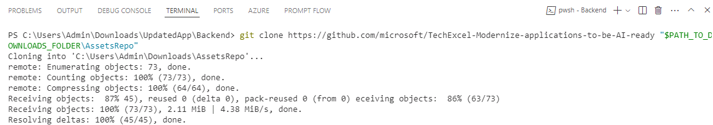
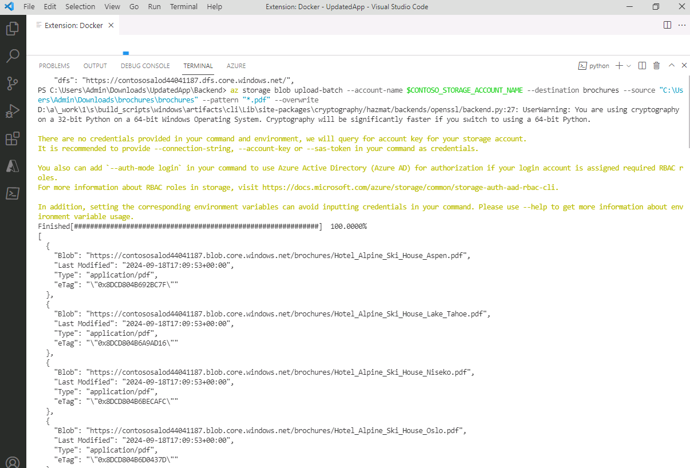
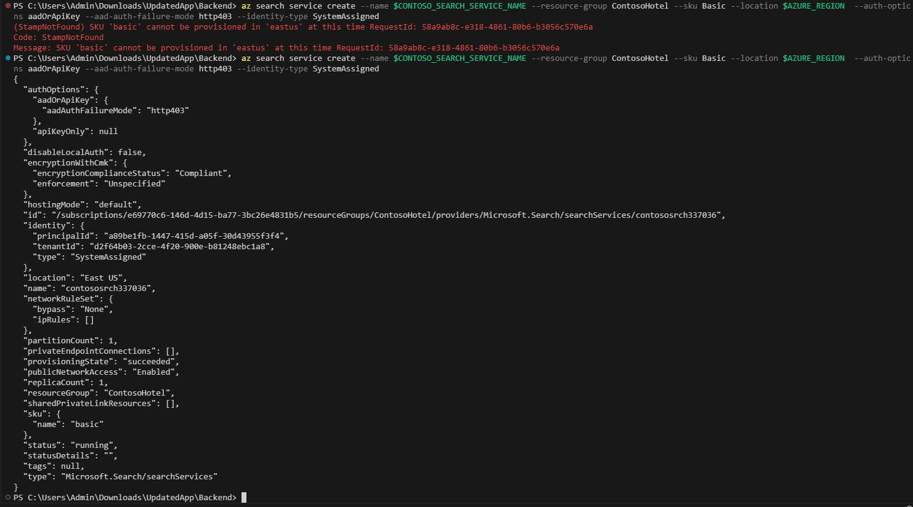
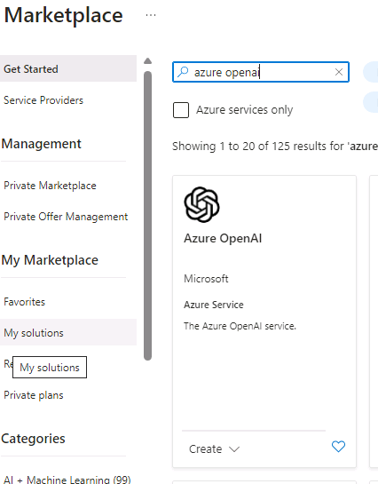
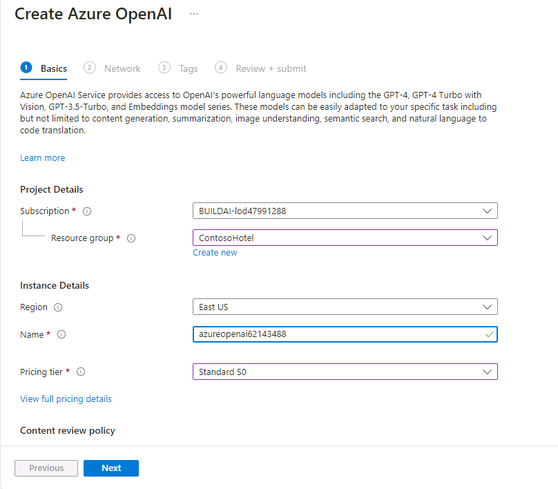
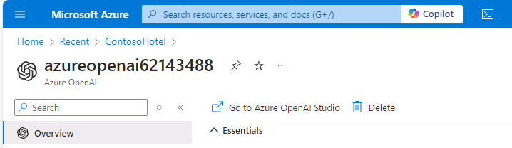
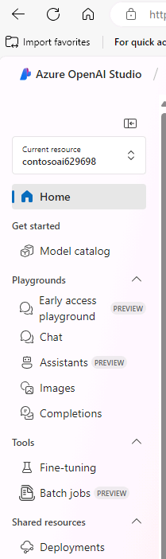
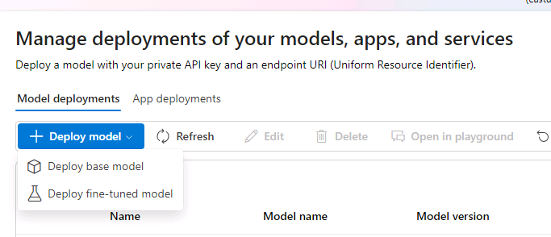
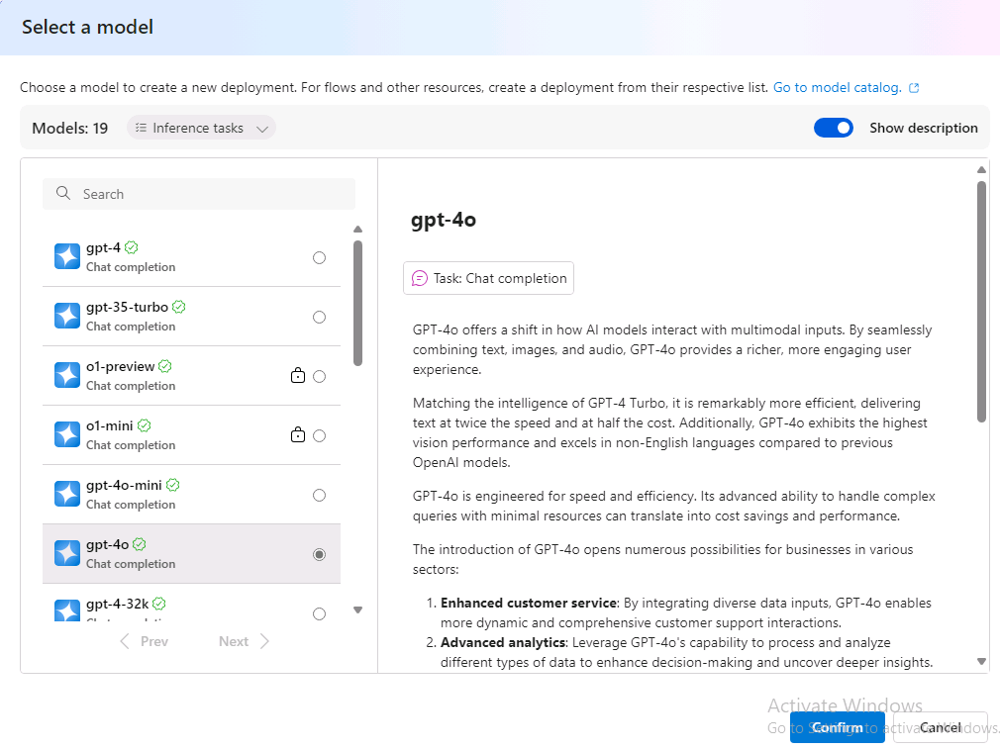
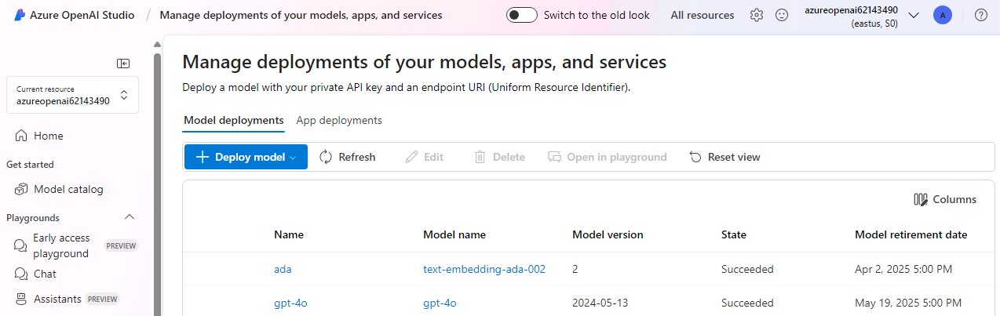

# Task 01 - Create Azure services

<!--- Estimated time: 7 minutes---> 

## Introduction

You can use Azure Blob Storage to contain the brochures for the hotels. Storing the brochures in Azure Blob Storage ensures that the brochures are available for searching by Azure AI Search Service.

Azure AI services is a set of cloud-based APIs that you can use in AI applications and data flows. This lab uses Azure OpenAI Service and Azure AI Search to scan and index the data from the hotel brochures. 

Azure OpenAI services allow you to deploy a variety of large language models so that you can enhance applications by adding AI capabilities.

## Description

In this task, you’ll create an Azure Blog Storage account and then upload a set of PDF files to the storage account. Each PDF file is a brochure for one of the hotels represented in the Contoso Hotels app. Then, you’ll provision an Azure Search Service instance. Finally, you’ll provision an Azure OpenAI service instance and deploy models to the instance. 

The key steps are as follows:

1. Create an Azure Storage account and container.
1. Download the folder which contains the hotel brochures to your local machine.
1. Upload the brochures to the storage container.
1. Create an Azure AI Search Service instance.
1. Provision Azure OpenAI Service and deploy GPT-4o and Text-Embedding-ADA-002 models.


## Success Criteria

- You’ve uploaded the hotel brochures to the container in the Azure Storage account. 
- You’ve created an Azure AI Search Service instance.
- You’ve deployed GPT-4o and Text-Embedding-ADA-002 to Azure OpenAI service.

## Learning Resources

- [**Create an Azure Storage account**](https://learn.microsoft.com/en-us/training/modules/create-azure-storage-account/ )
- [**Create a storage container**](https://learn.microsoft.com/en-us/training/modules/create-azure-storage-account/5-exercise-create-a-storage-account)
- [**GitHub repository with assets for this workshop**](https://github.com/microsoft/TechExcel-Modernize-applications-to-be-AI-ready )

## Solution

<details markdown="block">
<summary>Expand this section to view the solution</summary>


1. In Visual Studio Code, enter the following commands at the Terminal window prompt. This command ensures that you’re still signed in.

    ```
    az login
    ```

1. If $AZURE_REGION is not still set, update the value of the **AZURE_REGION_FROM_EX01_TASK01** variable to use the region that you selected in Exercise 01 Task 01. Then, enter the command at the Terminal window prompt.

    ```
    $AZURE_REGION="AZURE_REGION_FROM_EX01_TASK01"
    ```

1. In Visual Studio Code, enter the following commands at the Terminal window prompt. These commands create a storage account and a storage container.
   
    ```
    $CONTOSO_STORAGE_ACCOUNT_NAME="contososa$(Get-Random -Minimum 100000 -Maximum 999999)"
    az storage account create --name $CONTOSO_STORAGE_ACCOUNT_NAME --resource-group ContosoHotel --location $AZURE_REGION --sku Standard_LRS
    az storage container create --name brochures --account-name $CONTOSO_STORAGE_ACCOUNT_NAME
    ```


1. Open a browser window and go to [**Azure portal**](https://portal.azure.com). Sign in to Azure.

1. On the Azure Home page, select **Resource groups** and then select **ContosoHotel**.

1. In the list of resources that displays, sort the resources by the Type column. Locate the row for the Storage account that was created and record the Storage account name. You’ll need the name in an upcoming task.

1.  Open File Explorer on your computer and go to the **Downloads** folder. Update the following variable to use the path for your **Downloads** folder.

    ```
    $PATH_TO_DOWNLOADS_FOLDER = "C:\Users\Admin\Downloads"
    ```

1. In Visual Studio Code, enter the following command at the Terminal window prompt. This command clones assets for this workshop including hotel brochures from a GitHub repository to a folder in your **Downloads** folder. 

    ```
    git clone https://github.com/microsoft/TechExcel-Modernize-applications-to-be-AI-ready "$PATH_TO_DOWNLOADS_FOLDER\AssetsRepo"
    ```

    


1. Enter the following command at the Terminal window prompt. This command uploads the brochures to the storage container that you created earlier in this task. 

    ```
    az storage blob upload-batch --account-name $CONTOSO_STORAGE_ACCOUNT_NAME --destination brochures --source "$PATH_TO_DOWNLOADS_FOLDER\AssetsRepo\Assets\PDFs" --pattern "*.pdf" --overwrite
    ```

    


1. Enter the following commands at the Terminal window prompt. These commands create the Azure Search Service instance.

    ```
    $CONTOSO_SEARCH_SERVICE_NAME="contososrch$(Get-Random -Minimum 100000 -Maximum 999999)"
    az search service create --name $CONTOSO_SEARCH_SERVICE_NAME --resource-group ContosoHotel --sku Basic --location $AZURE_REGION  --auth-options aadOrApiKey --aad-auth-failure-mode http403 --identity-type SystemAssigned
    ```

   {: .note }
   > It may take 10-15 minutes for provisioning to complete.

    

1. Open a browser window and go to [**Azure portal**](https://portal.azure.com). Sign in to Azure.

1. On the Azure Home page, select **Resource groups** and then select **ContosoHotel**.

1. In the list of resources that displays, record the name for the Search Service instance that you created. You’ll need the name in an upcoming task.

1. On the Azure Home page, select **+ Create a resource**. Search for **Azure OpenAI** and select **Azure OpenAI** in the list of search results.

1. Locate the **Azure OpenAI** tile. Select **Create** and then select **Azure OpenAI**.

    

1. On the **Create Azure OpenAI** page, enter the following information:

    | Setting | Value |
    |:---------|:---------|
    | Resource group   | **ContosoHotel**  |
    | Name  | **azureopenai62143490**|  
    | Pricing tier | **Standard S0** |

   {: .warning }
   > Azure will alert you if the service name is not unique. If you see an error message, add a digit or two to the service name.

     

1. Select **Next** three times and then select **Create**. Wait for the deployment to complete. 

1. When the deployment competes, select **Go to resource**.

1. Record the value for the Azure OpenAI instance name. You’ll use this value later in the lab.

1. On the Overview page for the OpenAI service, select **Go to Azure OpenAI Studio**.

    

1. On the Azure OpenAI Studio home page, in the left navigation pane, select **Deployments**.

    

1. On the **Deployments** page, select **+ Deploy model** and then select **Deploy base model**.

    

1. On the **Select a model** page, select **gpt-4o** and then select **Confirm**.

    

1. On the **Deploy model gpt-4o** page, select **Deploy**.

   {: .warning }
   > Record the value for the deployment name setting. You’ll use this value later in the lab.

1. Return to the **Deployments** page, select **+ Deploy model** and then select **Deploy base model**.

    

1. On the **Select a model** page, select **text-embedding-ada-002** and then select **Confirm**.

    

1. On the
**Deploy model text-embedding-ada-002** page, change the value for the Deployment name setting to **ada** and then select **Deploy**.

   {: .warning }
   > Record the value for the deployment name setting. You’ll use this value later in the lab.

1. Return to the **Deployments** page. Verify that both models are present. 

    

1. Close the **Azure OpenAI Studio** page. Leave Visual Studio Code open. 

</details>
