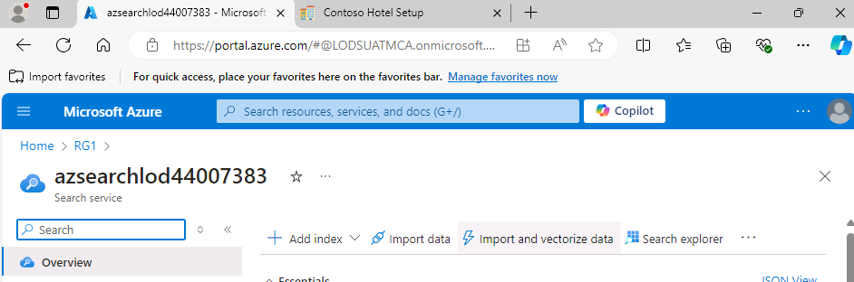
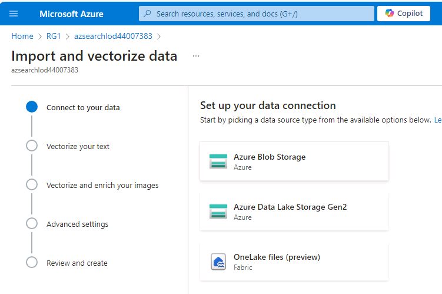
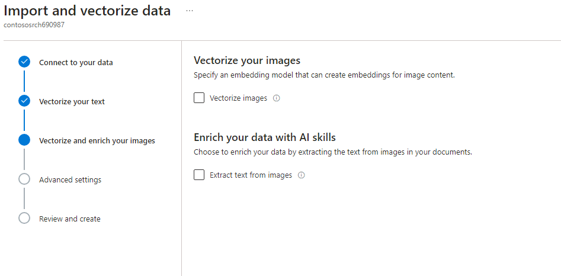
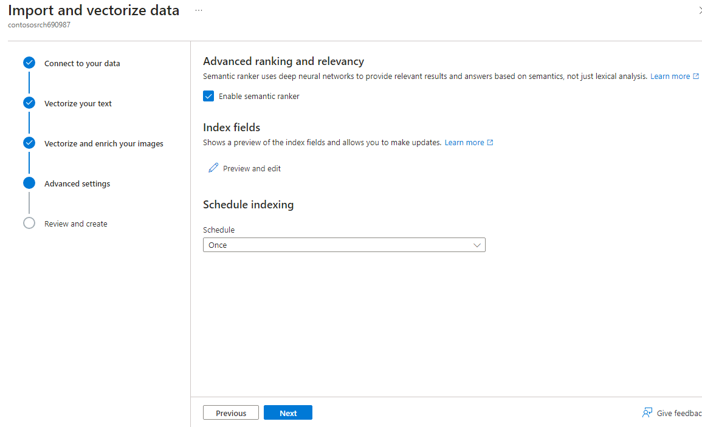
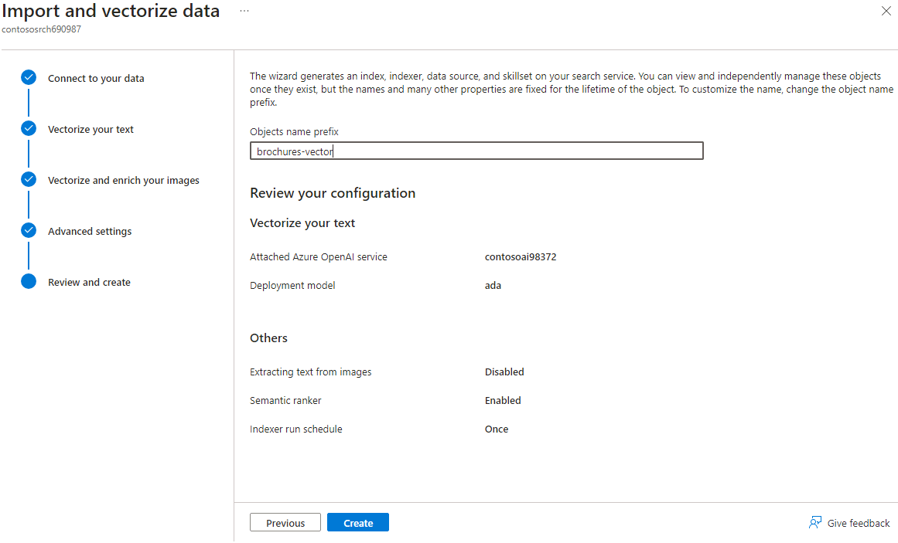

# Exercise 04 - Set up Azure resources and extract data from hotel brochures

## Lab Scenario

When people are making travel plans, they often select a hotel based on the location of the hotel or the amenities that the hotel offers. Most hotel websites make it easy to search their hotels by date and location. However, it it can be challenging to narrow down the list so that only hotels with specific amenities display.

Contoso wants to build a chatbot that helps potential guests find a hotel that meets their needs. For this solution, you will upload PDF versions of the Contoso Hotel brochures to an Azure Storage account. Then, you will use Azure Search service and Azure OpenAI service to scan the PDFs and extract information that a chatbot can use to respond to guest inquiries.

## Objectives

After you complete this lab, you will be able to:

- Create an Azure Blob Storage accountand a storage container
- Upload hotel brochures to the storage container
- Create an Azure Search Service instance
- Create an Azure OpenAI service instance and deploy models to the instance
- Configure managed identities for the services
- Extract data from the brochures and test the search index

## Exercise Duration

Estimated time to complete this exercise: *45 minutes*


## Task 01 - Create an Azure Blob Storage account and upload files

<!--- Estimated time: 7 minutes---> 

### Introduction


### Description

In this task, you will create an Azure Blog Storage account and then upload a set of PDF files to the storage account. Each PDF file is a brochure for one of the hotels represented in the Contoso Hotels app.

The key steps are as follows:

1. Create an Azure Storage account and container.
1. Download the folder which containst the hotel brochures to your local machine.
1. Upload the brochures to the storage container.

### Success Criteria

- You have uploaded the hotel brochures to the container in the Azure Storage account. 

### Learning Resources

- [**Create an Azure Storage account**](https://learn.microsoft.com/en-us/training/modules/create-azure-storage-account/ )
- [**Create a storage container**](https://learn.microsoft.com/en-us/training/modules/create-azure-storage-account/5-exercise-create-a-storage-account)
- [**GitHub repository with assets for this workshop**](https://github.com/microsoft/TechExcel-Modernize-applications-to-be-AI-ready )

### Solution

<details markdown="block">
<summary>Expand this section to view the solution</summary>


1.  In Visual Studio Code, enter the following commands at the Terminal window prompt. This command ensures that you are still signed in.

    ```
    az login    
    ```

1.  Update the value of the $AZURE_REGION variable to use the region that you selected in Exercise 01 Task 01.

    ```
    $AZURE_REGION ="XXXXXXXXXXXXX"
    ```

1.  In Visual Studio Code, enter the following commands at the Terminal window prompt. These commands create a storage account and a storage container.
   
    ```
    $CONTOSO_STORAGE_ACCOUNT_NAME="contososa$(Get-Random -Minimum 100000 -Maximum 999999)"
    az storage account create --name $CONTOSO_STORAGE_ACCOUNT_NAME --resource-group ContosoHotel --location $AZURE_REGION --sku Standard_LRS
    az storage container create --name brochures --account-name $CONTOSO_STORAGE_ACCOUNT_NAME
    ```
1.  Open a web browser and go to [**GitHub repository for this workshop**](https://github.com/microsoft/TechExcel-Modernize-applications-to-be-AI-ready ).

1.   Open File Explorer on your computer and go to the Downloads folder. Update the following variable to use the path for your Downloads folder.

    ```
    $PATH_TO_DOWNLOADS_FOLDER = "C:\Users\XXXXXXXX\Downloads"
    ```

1.  In Visual Studio Code, enter the following commands at the Terminal window prompt. This command clones assets for this workshop including hotel brochures from a GitHub repository to a folder in your Downloads folder. 

    ```
    git clone https://github.com/microsoft/TechExcel-Modernize-applications-to-be-AI-ready "$PATH_TO_DOWNLOADS_FOLDER\AssetsRepo"
    ```

    


1.  Enter the following command at the Terminal window prompt. This command uploads the brochures to the storage container that you created earlier in this task. 

    ```
    az storage blob upload-batch --account-name $CONTOSO_STORAGE_ACCOUNT_NAME --destination brochures --source "$PATH_TO_DOWNLOADS_FOLDER\AssetsRepo\Assets\PDFs" --pattern "*.pdf" --overwrite
    ```

    

1.  Leave Visual Studio Code open. You will run addtional commands in the next exercise.

</details>


## Task 02 - Create additional Azure services

<!--- Estimated time: 20 minutes---> 

### Introduction

Azure AI services is a set of cloud-based APIs that you can use in AI applications and data flows. This lab uses Azure OpenAI Service and Azure Search Service to scan and index the data from the hotel brochures. 

### Description

In this task, you will provision both services. Then, you will deploy required AI models to the Azure OpenAI service that you created.

The key steps are as follows:

1. Create an Azure AI Services account.
1. Deploy the text-embedding-ada-00 and gpt-4o models to the account.
1. Create an Azure Search Services instance.

### Success Criteria

- You have successfully deployed the text-embedding-ada-00 and gpt-4o models
- You have successfully provisioned an Azure Search Services instance

### Learning Resources

- [**Choose an Azure AI Services technology**](https://learn.microsoft.com/en-us/azure/architecture/data-guide/technology-choices/cognitive-services)
- [**Azure OpenAI Service**](https://azure.microsoft.com/en-us/products/ai-services/openai-service/)

### Solution

<details markdown="block">
<summary>Expand this section to view the solution</summary> 

1.  Enter the following commands at the Terminal window prompt. These commands create the Azure OpenAI Service instance.

    ```
    $CONTOSO_AI_NAME="contosoai$(Get-Random -Minimum 100000 -Maximum 999999)"
    az cognitiveservices account create --name $CONTOSO_AI_NAME --resource-group ContosoHotel --kind OpenAI --sku S0 --location $AZURE_REGION --assign-identity --yes 
    ```

    >{: .note } It may take 10-15 minutes for provisioning to complete. You can check the status of it by going to **Azure** -> Search for '**Azure OpenAI**' -> Select '**contosoai[xxxxxx]**' and it should load once provisioned.

    

1.  Enter the following commands at the Terminal window prompt. These commands deploy models to the Azure OpenAI Service instance that you created.

    ```
    az cognitiveservices account deployment create --name $CONTOSO_AI_NAME --resource-group ContosoHotel --deployment-name "ada" --model-name "text-embedding-ada-002" --model-version "2" --model-format "OpenAI" --sku-capacity "200" --sku-name "Standard"
    az cognitiveservices account deployment create --name $CONTOSO_AI_NAME --resource-group ContosoHotel --deployment-name "gpt-4o" --model-name "gpt-4o" --model-version "2024-05-13" --model-format "OpenAI" --sku-capacity "200" --sku-name "GlobalStandard"
    ```

    >{: .important } After you create the Cognitive services account and deploy the models, it may take 10-15 minutes before the services are fully available and ready for Step 3.

    

1.  Enter the following commands at the Terminal window prompt. These commands create the Azure Search Service instance.

    ```
    $CONTOSO_SEARCH_SERVICE_NAME="contososrch$(Get-Random -Minimum 100000 -Maximum 999999)"
    az search service create --name $CONTOSO_SEARCH_SERVICE_NAME --resource-group ContosoHotel --sku Basic --location $AZURE_REGION  --auth-options aadOrApiKey --aad-auth-failure-mode http403 --identity-type SystemAssigned
    ```

    >{: .note } It may take 10-15 minutes for provisioning to complete.

1.  Leave Visual Studio Code open. You will run addtional commands in the next task.

</details>


## Task 03 - Configure managed identities for deployed resources

<!--- Estimated time: 5 minutes---> 

### Introduction

Managing permissions and access for users and Azure resources can be challenging. Managed identities help you deploy secure solutions on Azure without the need to manage credentials. You can create system-assigned and user-assigned managed identities. For this lab, you will use system-assgined managed identities. You enable this type of identity directly on the Aure resource.

### Description

In this task, you will create a set of managed identities so that the various Azure resources you created can communicate with each other.

The key steps are as follows:

1. Configure the Azure OpenAI and Azure Search instances to use system-assigned managed identities.
1. Configure a managed identity to allow the Azure Search and Azure OpenAI instances to access the Azure Blob Storage account.
1. Configure a  managed identity to allow Azure Search instance to access the Azure OpenAI Service instance.
1. Configure a  managed identity to allow Azure OpenAI Service instance to access the  Azure Search instance.

### Success Criteria

- You have configured managed identities so that the Azure Blob Storage account, Azure Search Service instance, and Azure OpenAI Service instance can communicate with each other. 

### Learning Resources

- [**Implement managed identities**](https://learn.microsoft.com/en-us/training/modules/implement-managed-identities/
)

### Solution

<details markdown="block">
<summary>Expand this section to view the solution</summary>

1.  Enter the following commands at the Terminal window prompt. These commands configure both the Azure Search and Azure OpenAI instances to use system-assigned managed identities.

    ```
    az search service update --name $CONTOSO_SEARCH_SERVICE_NAME --resource-group ContosoHotel --identity-type SystemAssigned
    az cognitiveservices account identity assign --name $CONTOSO_AI_NAME --resource-group ContosoHotel
    ```

1.  Enter the following commands at the Terminal window prompt. These commands allow the Azure Search and Azure OpenAI instances to access the Azure Blob Storage account.

    ```
    $SEARCH_IDENTITY=$(az search service show --name $CONTOSO_SEARCH_SERVICE_NAME --resource-group ContosoHotel --query identity.principalId -o tsv)
    $AI_IDENTITY=$(az cognitiveservices account identity show --name $CONTOSO_AI_NAME --resource-group ContosoHotel --query principalId -o tsv)
    $STORAGE_SCOPE=$(az storage account show --name $CONTOSO_STORAGE_ACCOUNT_NAME --resource-group ContosoHotel --query id -o tsv)
    az role assignment create --role "Storage Blob Data Contributor" --assignee $SEARCH_IDENTITY --scope $STORAGE_SCOPE
    az role assignment create --role "Storage Blob Data Contributor" --assignee $AI_IDENTITY --scope $STORAGE_SCOPE
    ```

1.  Enter the following commands at the Terminal window prompt. These commands allow the Azure Search to access the Azure OpenAI Service instance you created.

    ```
    $AI_SCOPE=$(az cognitiveservices account show --name $CONTOSO_AI_NAME --resource-group ContosoHotel --query id -o tsv)
    az role assignment create --role "Cognitive Services OpenAI Contributor" --assignee $SEARCH_IDENTITY --scope $AI_SCOPE
    ```

1.  Enter the following commands at the Terminal window prompt. These commands allow the Azure OpenAI Service instance to access the Azure Search Service instance you created.

    ```
    $SEARCH_SCOPE=$(az search service show --name $CONTOSO_SEARCH_SERVICE_NAME --resource-group ContosoHotel --query id -o tsv)
    az role assignment create --role "Search Index Data Contributor" --assignee $AI_IDENTITY --scope $SEARCH_SCOPE
    az role assignment create --role "Search Index Data Reader" --assignee $AI_IDENTITY --scope $SEARCH_SCOPE
    az role assignment create --role "Search Service Contributor" --assignee $AI_IDENTITY --scope $SEARCH_SCOPE
    ```
1.  Leave Visual Studio Code open. You will run addtional commands in the next task.

</details>


## Task 04 - Configure Azure Search to extract data from the brochures and test the search index

<!--- Estimated time: 10 minutes---> 

### Introduction


### Description

In this task, you will use Azure Search to import and vectorize data from the hotel brochures. You will then test the index.

The key steps are as follows:

1. Launch the import and vectorize data and connect to Azure Blob Storage.
1. Vectorize text from the brochures.
1. Index the data.
1. Test the index.

### Success Criteria

- You have successfully completed all steps in the Import and vectorize data wizard. 
- You have tested the search index by using Search Explorer and can view results.

### Learning Resources

- [**Azure Search Overview**](https://learn.microsoft.com/en-us/azure/search/search-what-is-azure-search)
- [**Integrated data chunking and embedding in Azure AI Search**](https://learn.microsoft.com/en-us/azure/search/vector-search-integrated-vectorization)
- [**Quickstart: Vectorize text and s by using the Azure portal**](https://learn.microsoft.com/en-us/azure/search/search-get-started-portal-import-vectors?tabs=sample-data-storage%2Cmodel-aoai%2Cconnect-data-storage)
- [**Manage your Azure AI Search service with the Azure CLI**](https://learn.microsoft.com/en-us/azure/search/search-manage-azure-cli)

### Solution

<details markdown="block">
<summary>Expand this section to view the solution</summary>

1.  1.  Open a browser window and go to [**Azure portal**](https://portal.azure.com). Sign in to Azure.

1.  On the Azure Home page, select **Resource groups** and then select **ContosoHotel**.

1.  In the list of resources that displays, select the Azure Search service instance from the list of resources.

1.  On the Overview page for the Search service, select **Import and vectorize data**.

    

1.  On the Connect to your data page, select **Azure Blob Storage**.

    

1.  On the Configure your Azure Blob Storage page, enter the following information and then select **Next**. Wait while Azure validates the connection:

    | Setting | Value |
    |:---------|:---------|
    | Storage acccount   | **contosoa[xxxxxx]**   |
    | Blob container   | **brochures**| 

    >{: .important } The data import wizard will fail at this step if you have not uploaded any brochures to the storage container.</br></br> You may see an error stating "No access to this subscription, or no Azure OpenAI service available under it". If this error displays, exit from the Import and vectorize data wizard, wait 10 minutes, and try again.

1.  On the *Vectorize your text* page, enter the following information:

    | Setting | Value |
    |:---------|:---------|
    | Kind   | **Azure OpenAI**  |
    | Azure OpenAI service  | Select the name for the Azure OpenAI service instance that you created|  
    | Model deployment | **ada** |
    |Authentication type | **System assigned identity**|

1.  Select the checkbox to acknowledge that connecting to Azure OpenAI service will incur costs and then select **Next**. Select **Next** again to skip the Vecorize and enrich your s step.

    

1.  On the *Advanced settings* page, select **Enable semantic ranker**. In the Shedule indexing drop-down list, select **Once**.

    

1.  On the *Review and create* page, enter **brochures-vector** in the Objects name prefix text field and then select **Create**. Wait for the the creation process to complete and select **Close**.

    

1.  In the left navigation pane for the Search Service instance, in the Search management section, select **Indexers**.

1.  Review the value for the Status column.


1.  In the left navigation pane for the Search Service instance, in the Search management section, select **Indexes** and then select the **brochures-vector** index.

1.  On the brochures-vector page, select **Search explorer**.

1.  In the Search field, enter **Athens** and then select **Search**.

1.  Review the output from the search operation. The results should list data about Athens and shold also contain a text vector.

1.  Leave Visual Studio Code open. You will run addtional commands in the next exercise.
