# Task 02 - Import and configure a flow

<!--- Estimated time: 40 minutes---> 

## Introduction

A flow encapsulates the logic that tells the chatbot what it can do and how to do things. Creating a flow can be complicated. For this lab, you’ll use a pre-built flow. The flow uses the OpenAI API to directly query the Azure Search index. 

The flow collects inputs and performs several steps. The diagram below depicts the logical operations that the flow performs.

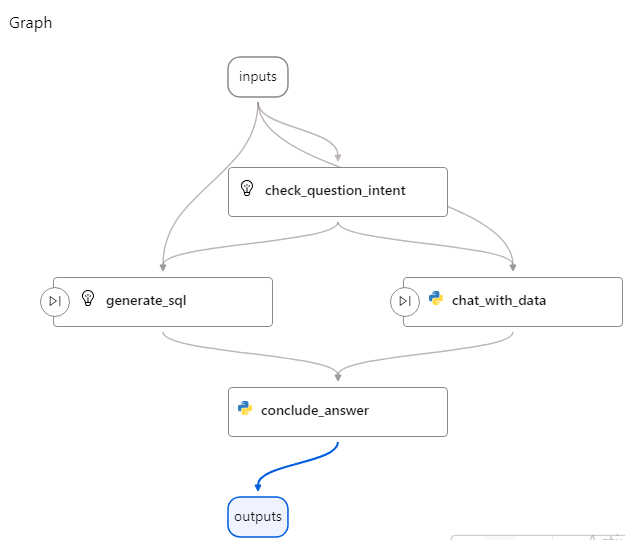

{: .note }
> AI Studio also includes an integrated vector search feature. We didn’t specify the use of the integrated vector search feature for this lab because we can’t deploy a flow that uses the feature to a container at this time.

## Description

In this task, you’ll import a pre-built flow, configure flow settings, and then test the flow.

The key steps are as follows:

1. Import a pre-built flow into the project.
1. Configure the flow.
1. Test the flow.

## Success Criteria

- You’ve imported and configured a pre-built flow.
- You’ve tested the flow and confirmed that the flow returns appropriate results.

## Learning Resources

- [**Develop your own custom copilots with Azure AI Studio**](https://learn.microsoft.com/en-us/training/paths/create-custom-copilots-ai-studio/)
- [**Get started with prompt flow**](https://learn.microsoft.com/en-us/training/modules/get-started-prompt-flow-ai-studio/)
- [**Prompt flow in Azure AI Studio**](https://learn.microsoft.com/en-us/azure/ai-studio/how-to/prompt-flow)
- [**Add a new connection in Azure AI Studio**](https://learn.microsoft.com/en-us/azure/ai-studio/how-to/connections-add)

## Solution

Expand this section to view the solution

1. Return to the Azure AI Studio browser window. 

   {: .note }
   > If you closed the window, go to [**Azure AI Studio**](ai.azure.com).

1. In the left navigation pane for the hub, select **Hub Overview**.

1. On the Overview page for the hub, locate the **Projects** section and select **+ New project**.

1. In the **Project name** field, enter **contosopf** and then select **Create a project**. Wait for the project to be created.

    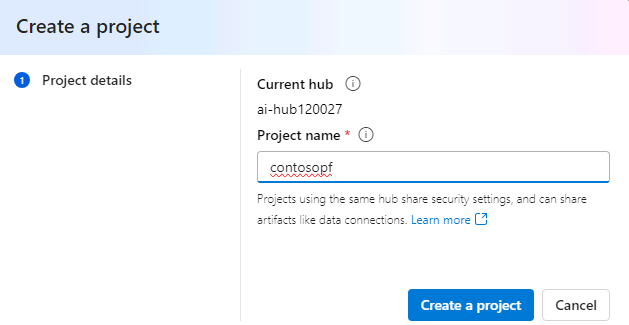

1. In the left navigation pane for the project page, in the **Tools** section, select **Prompt flow**.

    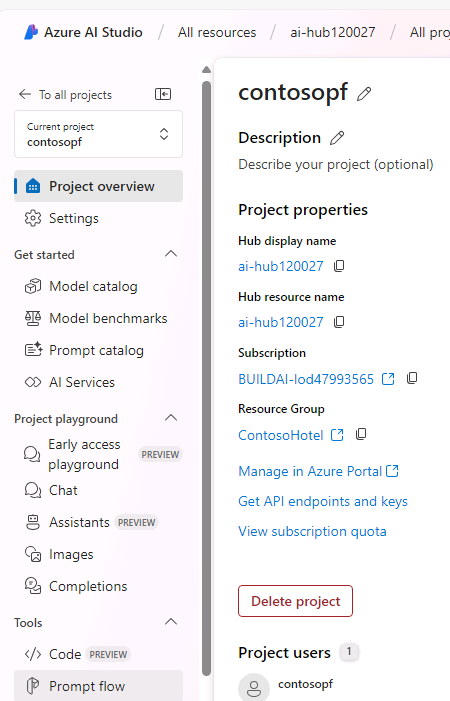

1. On the **Create, iterate, and debug your orchestration flows** page, select **+Create**.

1. On the **Create a new flow** page, in the **Upload from local** section, select **Upload**.

    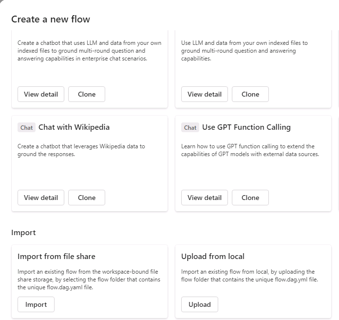

1. On the **Upload from local** page, select **Zip file** and then select **Browse**. Go to the **Downloads\AssetsRepo\Assets** folder.

   {: .note }
   > You created this folder in Exercise 04 Task 01 when you cloned the GitHub repository to acquire the hotel brochures.

1. Select **chatflow-oai-datasources..zip** and then select **Open**. 

1. Under **Select flow type**, select **Chat flow**. Then select **Upload** to import the zip file into the project. 

    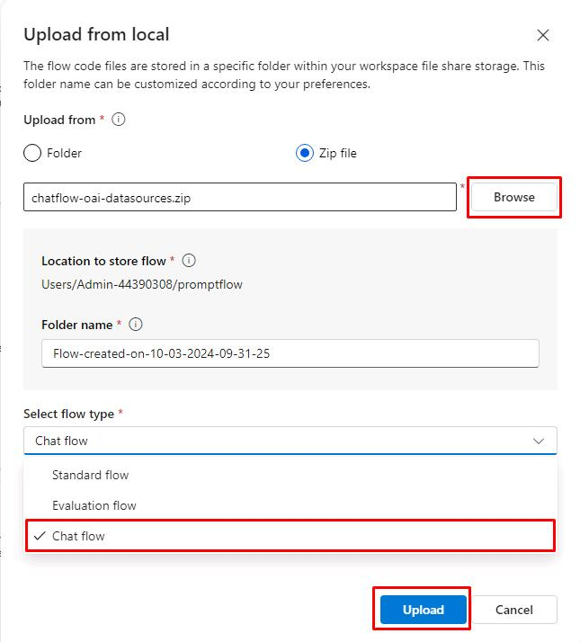

   {: .warning }
   > It may take several minutes to upload the flow. Separately, if you receive the following error or the **Upload** button becomes available again, wait a few minutes and try again.

    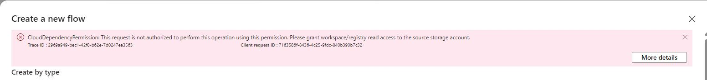

1. This will load the prompt flow once uploaded. In the middle pane for the flow, you’ll see one flow for each of the four logical steps in the flow. Review the information in each tile. This will help you understand how the flow functions.

1. Open a new browser window and go to [**Azure portal**](https://portal.azure.com).

1. Search for and select the PostgreSQL database that you created in a previous exercise.

    

1. In the Overview section for the database, copy the value for Server name. You’ll pass the value into a field in Step 18 of this task.

1. In the left navigation pane for the flow, select **Settings** and then select **+ New connection**.

    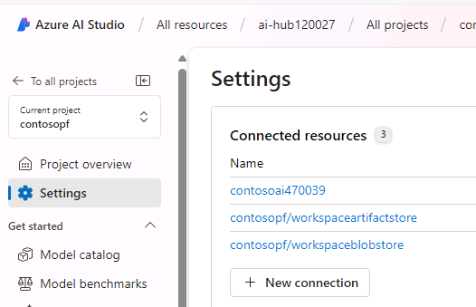

1. On the **Add a connection to external assets** page, select **Custom keys**.

    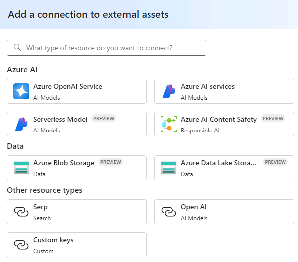

1. Select **+ Add key value pairs**.

1. Enter the following information. 

    | Field | Value |
    |:---------|:---------|
    | Custom keys      | **hostname**   |
    | Value   | Use the server name you copied in Step 14 of this lab|

1. Select **+ Add key value pairs**.

1. Enter the following information. 

    | Field | Value |
    |:---------|:---------|
    | Custom keys      | **user**   |
    | Value   | **promptflow**|

1. Select **+ Add key value pairs**.

1. Enter the following information. 

    | Field | Value |
    |:---------|:---------|
    | Custom keys      | **port**   |
    | Value   | **5432**|

1. Select **+ Add key value pairs**.

1. Enter the following information. 

    | Field | Value |
    |:---------|:---------|
    | Custom keys      | **database**   |
    | Value   | **pycontosohotel**|

1. Select **+ Add key value pairs**.

1. Enter the following information. 

    | Field | Value |
    |:---------|:---------|
    | Custom keys      | **passwd**   |
    | Value   | **1234ABCD!**|
    | Is Secret| Selected|

1. In the **Connection name** field, enter **postgresql** and then select **Add connection**. Wait while the connection is created. The connection should resemble the following screenshot:

    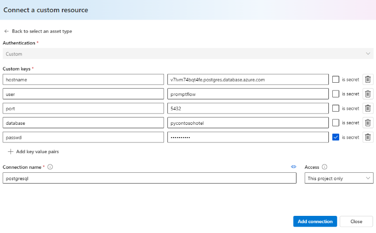

1. From **Settings**, select **+ New Connection** again.

1. Select **Azure AI Search**.

    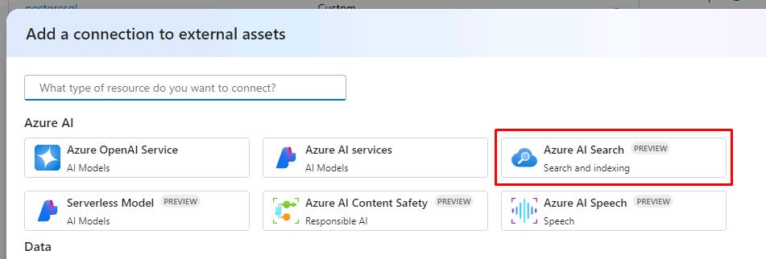

1. Select **Add connection** to the right of your Azure AI Search Service.

    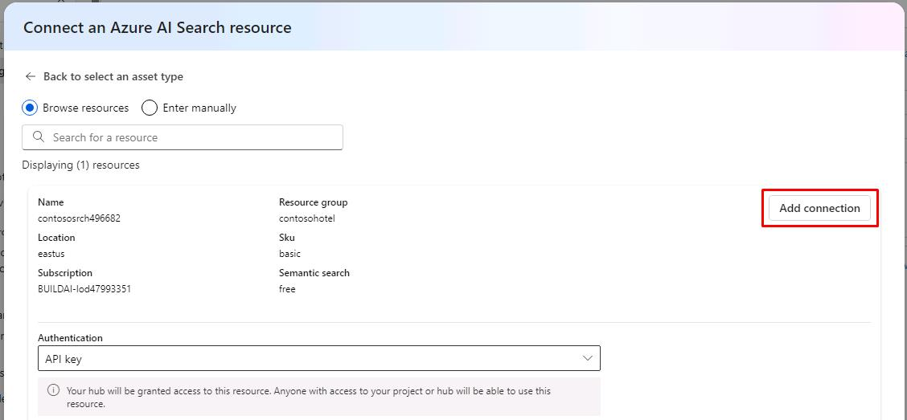

1. In the left navigation pane, under the **Components** section, select **Deployments**, and then select your **gpt-4o** model.

    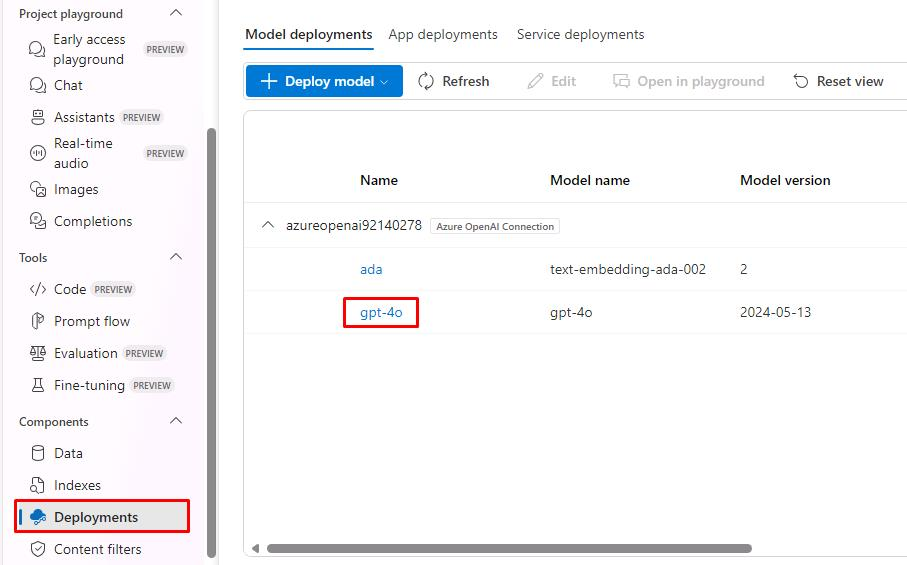

1. Select **Edit**.

    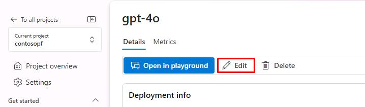

1. The **Tokens per Minute Rate Limit** needs to be increased from the default for the chatbot to function.

    1. Change the value to **10K**.
    1. Select **Save and close**.

   {: .warning }
   > Dragging the slider does not allow for small increments. Select the **white dot** on the slider, then use **Left/Right Arrow Keys** to change the value. 

    

1. In the left navigation pane for the flow, in the **Tools** section, select **Prompt flow** and then select the prompt flow that you created.

1. Select **Start compute session**. This allows you to run and test the chatbot. Continue to the next steps to finish configurations while this starts.

    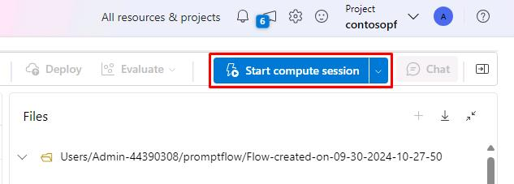

1. Locate the **check_question_intent** tile. In the **Connection** field, select the connection that displays.

    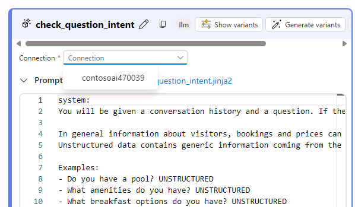

1. Scroll down to the **chat_with_data** tile and below the **Inputs** section. 

    1. Select **Value** of **search_connection** and then select your **Azure AI Search Service** from the dropdown list.
    1. Select **Value** of **ai_connection** and then select your **Azure OpenAI** resource from the dropdown list.
    1. Change the **Value** of **search_index** to **brochures-vector**.

    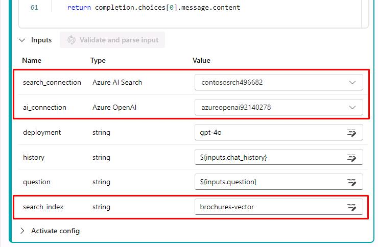

1. Scroll down to the **generate_sql** tile. In the **Connection** field, select the connection that displays.

    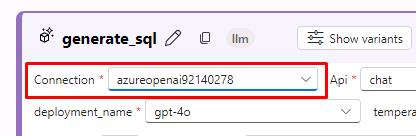

1. Scroll down to the bottom of the **conclude_answer** tile. We’ll input a value into the field that will populate after testing the next steps.

1. If the compute session has started, select **Chat** to test the flow.

    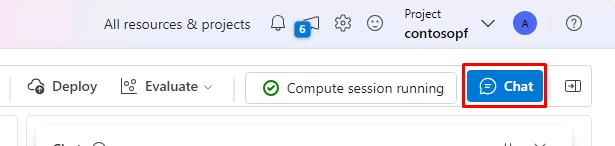

1. Enter **Where can I ski?** in the chat prompt and select **Enter**. This will give you a warning and populate the PostgreSQL property at the bottom of the **conclude_answer** tile.

    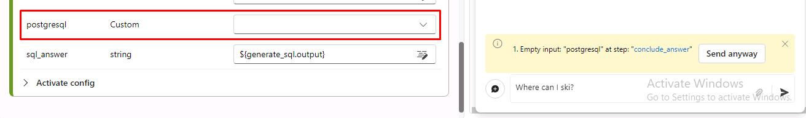

1. Select **Value** of **PostgreSQL**   and then select **postgresql** from the dropdown list.

    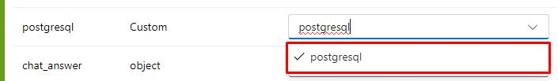

1. Select the **X** on the warning in the Chat, then send **Where can I ski?** again. Your results should resemble the following:

    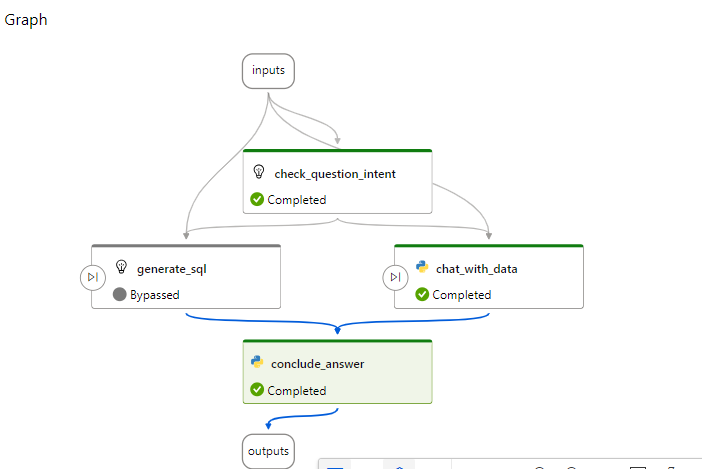
    
    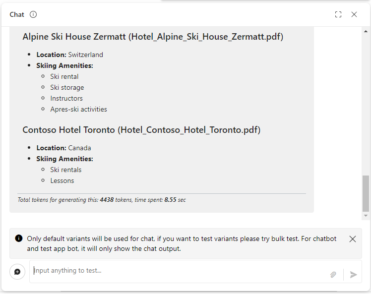

1. Start a new conversation and enter **How many free rooms do hotels in Switzerland have grouped by hotel on 2024-10-10?**. Your results should resemble the following:

    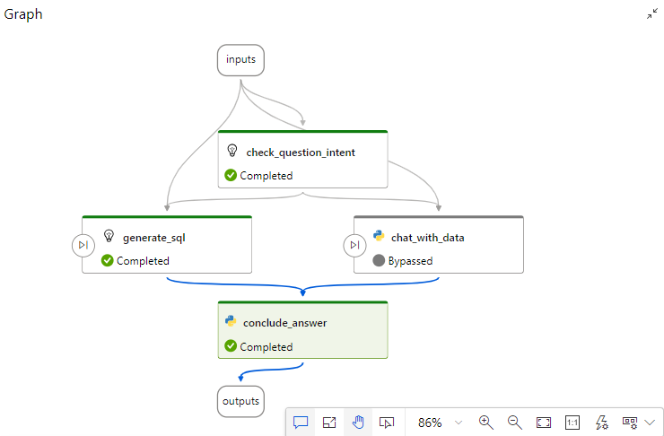
    
    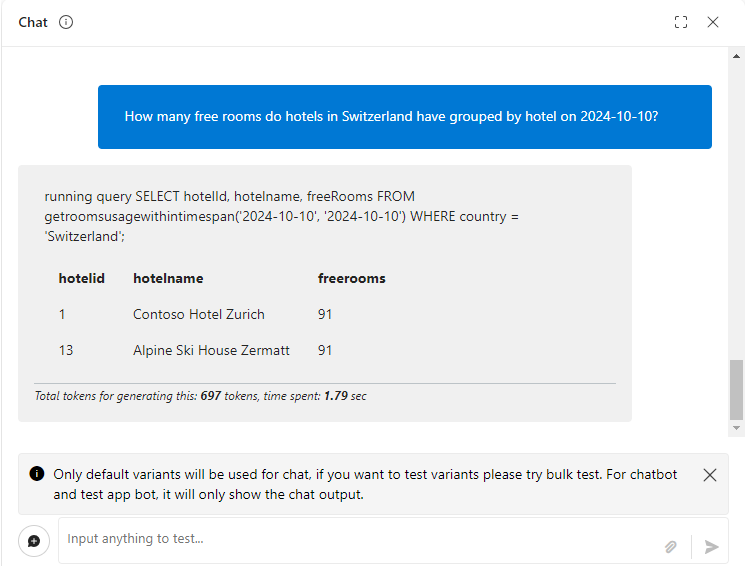

