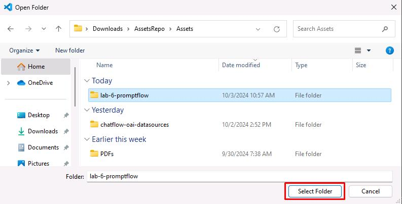
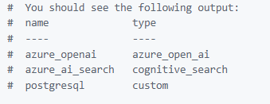
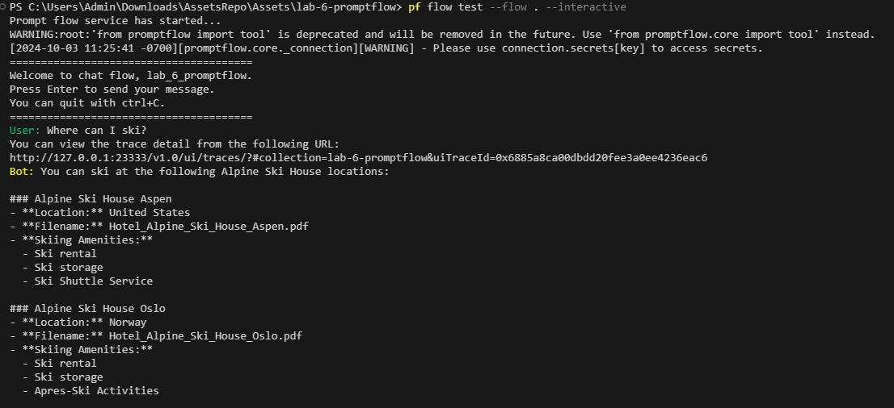
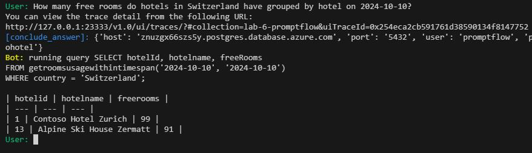
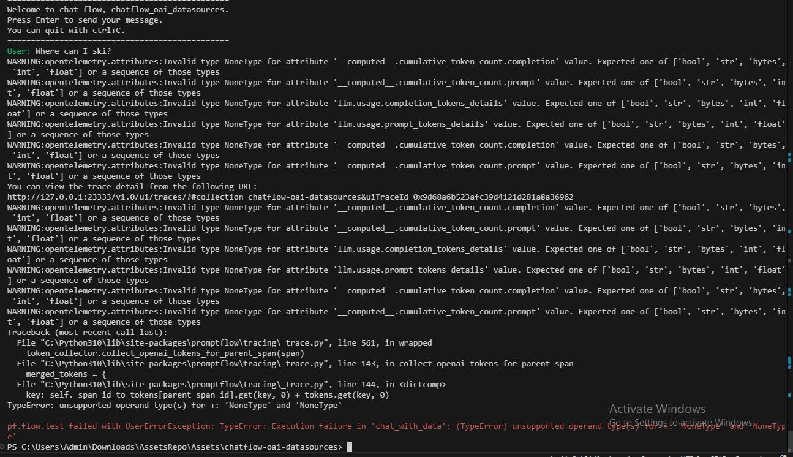

# Task 01 - Set up Visual Studio Code and run the flow locally

<!--- Estimated time: 15 minutes---> 

## Introduction


## Description

In this task you’ll test the chatbot locally before you publish the chatbot.

The key steps are as follows:

1. Configure your development environment in Visual Studio Code.
1. Create an environment file for the chatbot.
1. Create a connection to Azure OpenAI.
1. Run the chatbot locally to test the chatbot.


## Success Criteria

- You’ve set up your development environment.
- You’ve tested the chatbot locally.

## Learning Resources

- [**Deploy a flow using Docker**](https://microsoft.github.io/promptflow/how-to-guides/deploy-a-flow/deploy-using-docker.html)
- [**Prompt flow documentation**](https://microsoft.github.io/promptflow/reference/pf-command-reference.html#pf-flow)

## Solution

<details markdown="block">
<summary>Expand this section to view the solution</summary>

1. Open File Explorer and go to the **Downloads\AssetsRepo\Assets** folder.

1. Double-click **lab-6-promptflow.zip**. Select **Extract all** and then select **Extract**.

1. Launch Visual Studio Code as an administrator.

1. From the menu bar, select **File** and then select **Open Folder**.

1. Navigate into **AssetsRepo/Assets**, select **lab-6-promptflow**, and then select **Select folder**.

    

1. Select the option to **Trust the authors**.

1. In the Explorer pane, expand **lab-6-promptflow**.

1. Right-click **.env.sample** and then select **Rename**. Rename the file to **.env**.

1. Select **.env** to open the file in an Editor window.

1. Update the variables to use the same values that you used in Exercise 05, Task 01, Step 05.

    ```
    AZURE_OPENAI_ENDPOINT="https://azureopenai62143490.openai.azure.com/"
    AZURE_OPENAI_API_KEY="08c96b97791e44ea83c4dff67a76eb32"
    AZURE_OPENAI_DEPLOYMENT_ID="gpt-4o"
    AZURE_AI_SEARCH_ENDPOINT="https://contososrch799498.search.windows.net"
    AZURE_AI_SEARCH_INDEX="brochures-vector"
    AZURE_AI_SEARCH_API_KEY="ctkSfXrdBMgyYEIFOkECVmrWrdcRioV7wyAfqRVSNGAzSeAsUWls"
    PGHOST="mg32xpzwcffkg.postgres.database.azure.com"
    PGPORT="5432"
    PGUSER="promptflow"
    PGDATABASE="pycontosohotel"
    PGPASSWORD="1234ABCD!"
    ```

   {: .note }
   > To locate the values for AZURE_OPENAI_ENDPOINT and AZURE_OPENAI_API_KEY, in the Azure portal, select the Azure OpenAI resource you created. In the **Resource Management** section, select **Keys and Endpoints**. Use the Endpoint URL for AZURE_OPENAI_ENDPOINT and the key 1 value for AZURE_OPENAI_API_KEY.

   {: .note }
   > To locate the values for AZURE_AI_SEARCH_ENDPOINT, AZURE_AI_SEARCH_INDEX, and AZURE_AI_SEARCH_API_KEY, in the Azure portal, select the Search Service instance you created.  On the Overview page, use the URL for AZURE_AI_SEARCH_ENDPOINT. In the left hand navigation pane, in the **Search Management** section, select **Indexes**. Use the index name for AZURE_AI_SEARCH_INDEX. In the left navigation pane, in the **Settings** section, select **Keys**. Use Primary admin key for AZURE_AI_SEARCH_API_KEY.
    
   {: .note }
   > For all parameters that start with "PG", use the values from the PostgreSQL connection string that you recorded earlier in the lab.

1. Save   your changes to the **.env** file.

1. Open a new Terminal prompt by selecting **Terminal** from the top menu and then **New Terminal**. Enter the following commands to create environment variables. 

    ```
    get-content .env | foreach {
    $name, $value = $_.split('=')
    set-content env:\$name $value
    }
    ```
    
1. Enter the following commands in the Terminal to create a connection to Azure Open AI.

    ```
    # open ai connection
    pf connection create --file azure_openai.yaml --name azure_openai --set "api_base=$env:AZURE_OPENAI_ENDPOINT" --set "api_key=$env:AZURE_OPENAI_API_KEY"
    # ai search connection
    pf connection create --file azure_ai_search.yaml --name azure_ai_search --set "api_base=$env:AZURE_AI_SEARCH_ENDPOINT" --set "api_key=$env:AZURE_AI_SEARCH_API_KEY"
    # postgresql connection
    pf connection create --file postgresql.yaml --name postgresql --set "configs.hostname=$env:PGHOST" --set "configs.port=$env:PGPORT" --set "configs.user=$env:PGUSER" --set "configs.database=$env:PGDATABASE" --set "secrets.passwd=$env:PGPASSWORD"
    ```
    
1. Enter the following command at the Terminal window prompt. This command lists all connections.

    ```
    pf connection list | ConvertFrom-Json | Select-Object name, type |Format-Table
    ```

    

1. Enter the following command at the Terminal window prompt. This command installs all dependencies listed in the **requirements.txt** file.

    ```
    pip install -r requirements.txt
    ```

1. Enter the following commands at the Terminal window prompt. These commands run the flow interactively so that you can perform testing. 

    ```
    pf flow test --flow . --interactive
    ```

   {: .note }
   > Try **Where can I ski?** and then **How many free rooms do hotels in Switzerland have grouped by hotel on 2024-10-10?**

    

    

   {: .warning }
   > Error: "pf.flow.test failed with UserErrorException: TypeError: Execution failure in 'chat_with_data'"

    

    1. The installed '**openai**' Python package may be incompatible with the script and throw the error shown. Downgrading to 1.44.1 should resolve the issue.
    1. In the terminal you can check its version using **pip show openai**
    1. Downgrade the package by using **pip install openai==1.44.1**
    1. Run the interactive flow again:

        ```
        pf flow test --flow . --interactive
        ```

</details>
