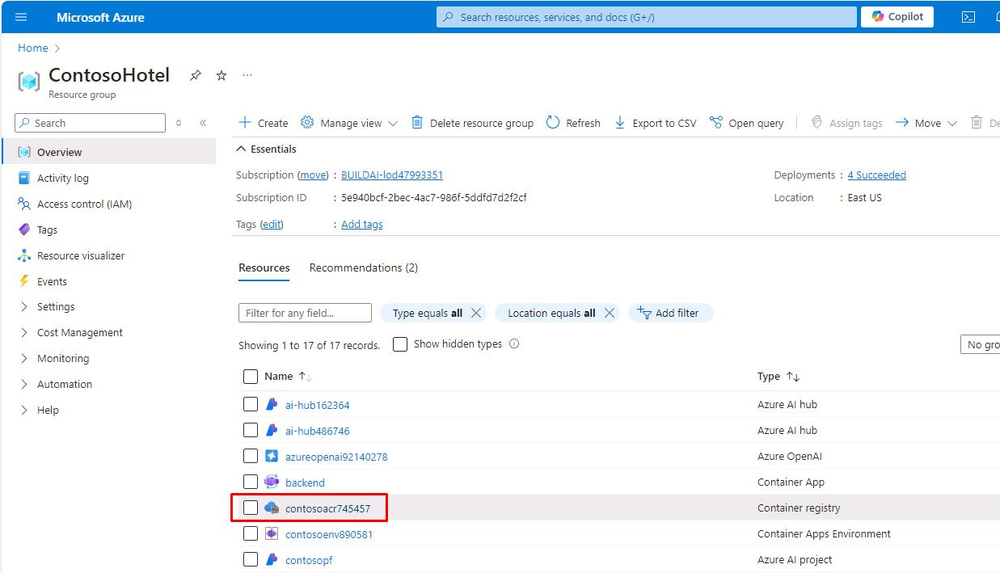
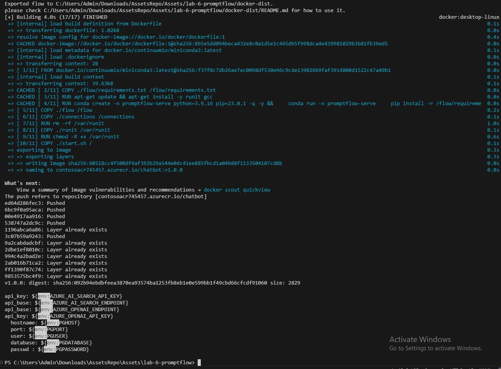
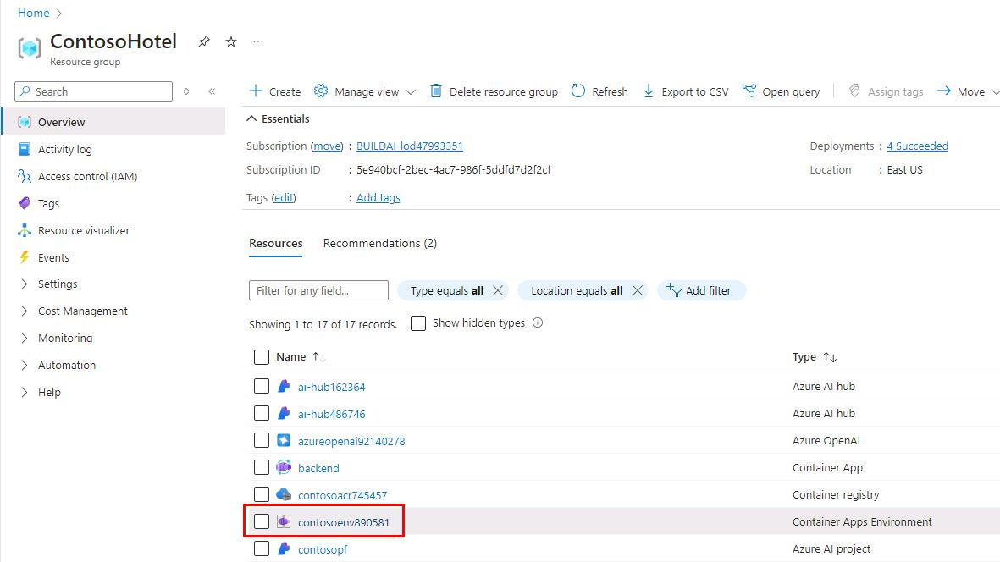
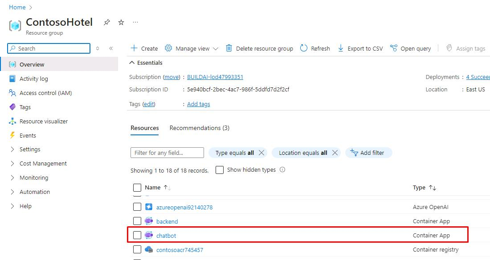
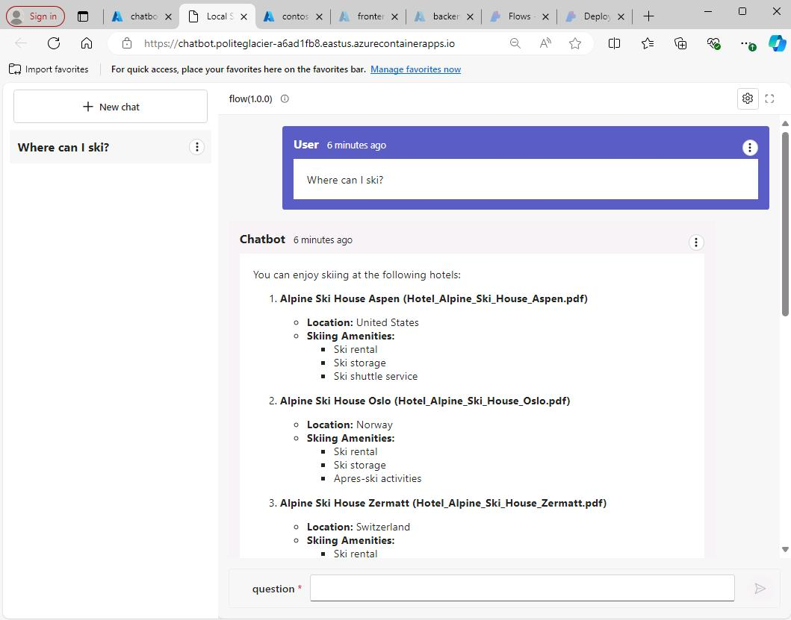
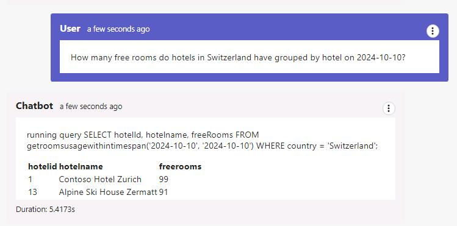

# Task 02 - Deploy the flow to Azure Container apps and test the app

<!--- Estimated time: 15 minutes---> 


## Description

In this task you’ll prepare the flow for deployment and deploy the flow. You’ll update the app to display the chatbot page.

The key steps are as follows:

1. Containerize the flow and push the flow to ACR.
1. Deploy the Container app and configure environmental variables.
1. Update the Contoso Hotel app to display the chatbot page.


## Success Criteria

- You’ve updated the app to include the chatbot feature.

## Learning Resources

- [**Deploy a flow using Docker**](https://microsoft.github.io/promptflow/how-to-guides/deploy-a-flow/deploy-using-docker.html)
- [**Promptflow Reference**](https://microsoft.github.io/promptflow/reference/pf-command-reference.html#pf-flow)

## Solution

<details markdown="block">
<summary>Expand this section to view the solution</summary>

1. Change the value of **$ACR_NAME** to the Container Registry created in the earlier exercise.

    ```
    $ACR_NAME="contosoacr745457"
    ```

   {: .note }
   > If you no longer have it noted down, you can find it again from the **ContosoHotel** Resource Group.

    

1. Enter the following command at the Terminal window prompt and sign in.

    ```
    az login
    ```

1. Enter the following commands in the Visual Studio Code Terminal window prompt. These commands containerize the flow and push the flow to ACR.

    ```
    # login to acr
    az acr login --name "$ACR_NAME"
    # create flow
    pf flow build --source . --output docker-dist --format docker
    # copy the azure_openai.yaml, azure_ai_search.yaml, and postgresql.yaml into the connections folder
    Copy-Item -Path .\azure_openai.yaml -Destination .\docker-dist\connections -Force
    Copy-Item -Path .\azure_ai_search.yaml -Destination .\docker-dist\connections -Force
    Copy-Item -Path .\postgresql.yaml -Destination .\docker-dist\connections -Force
    # build container
    docker build -t "$ACR_NAME.azurecr.io/chatbot:v1.0.0" ./docker-dist
    # push it to acr
    docker push "$ACR_NAME.azurecr.io/chatbot:v1.0.0"
    # have an overview of defined environment variables
    Get-ChildItem -Path '.\docker-dist\connections' -Filter '*.yaml' | Get-Content | Select-String 'env:'
    # clean up
    Remove-Item -Recurse -Force ./docker-dist
    ```

   {: .note }
   > Prompt flow creates the connection yaml files in the connections folder based on the pf connection command. Ensure that just three connections are defined and the names are azure_openai, azure_ai_search, and postgresql.

    

1. Configure and update the following variables based on your previous configurations and select **Enter**. **$CONTOSO_HOTEL_ENV** will be name of your **Container Apps Environment** found in the **ContosoHotel** Resource Group. The **_API_KEY**, **_ENDPOINT**, and **PGHOST** variable values can be found in the **.env file** from the last task.

    ```
    $CONTOSO_HOTEL_ENV = "contosoenv890581"
    
    $AZURE_OPENAI_ENDPOINT = "https://azureopenai92140278.openai.azure.com/"
    $AZURE_OPENAI_API_KEY = "d3d089a5cb8d4dc0b7d1adc80e549da7"

    $AZURE_AI_SEARCH_ENDPOINT = "https://contososrch496682.search.windows.net"
    $AZURE_AI_SEARCH_API_KEY = "sUqFKOnX57fUKS0NBeKscezjp5d6ZCY7WVR2AmYOtPAzSeCrtJ0q"

    $PGHOST = "znuzgx66szs5y.postgres.database.azure.com"
    ```

    

1. Enter the following to set the variables for values we've used previously.

    ```
    $RG_NAME = "ContosoHotel"
    $CONTOSO_ACR_CREDENTIAL = az acr credential show --name $ACR_NAME --query "passwords[0].value" -o tsv

    $PGUSER = "promptflow"
    $PGPASSWORD = "1234ABCD!"
    $PGDATABASE = "pycontosohotel"
    $PGPORT = "5432"
    ```

1. Enter the following commands in the Terminal to deploy the container to ACR and set environment variables. 

    ```
    az containerapp create --name "chatbot" --resource-group "$RG_NAME" --environment "$CONTOSO_HOTEL_ENV" `
    --image "$ACR_NAME.azurecr.io/chatbot:v1.0.0" --target-port 8080 --transport http `
    --registry-server "$ACR_NAME.azurecr.io" --registry-username "$ACR_NAME" --registry-password "$CONTOSO_ACR_CREDENTIAL" `
    --secrets "searchkey=$AZURE_AI_SEARCH_API_KEY" "openaikey=$AZURE_OPENAI_API_KEY" "pgpassword=$PGPASSWORD" `
    --env-vars "AZURE_AI_SEARCH_ENDPOINT=$AZURE_AI_SEARCH_ENDPOINT" "AZURE_AI_SEARCH_API_KEY=secretref:searchkey" `
    "AZURE_OPENAI_ENDPOINT=$AZURE_OPENAI_ENDPOINT" "AZURE_OPENAI_API_KEY=secretref:openaikey" `
    "PGHOST=$PGHOST" "PGPORT=$PGPORT" "PGUSER=$PGUSER" "PGDATABASE=$PGDATABASE" "PGPASSWORD=secretref:pgpassword"
    $CONTOSO_CHATBOT_URL = "https://$(az containerapp show --name "chatbot" --resource-group "$RG_NAME" --query 'properties.configuration.ingress.fqdn' -o tsv)"
    Write-Host -ForegroundColor Green  "Promptflow URL is: $CONTOSO_CHATBOT_URL"
    ```

    

1. Enter the following to pull and set the **$CONTOSO_BACKEND_URL** variable for use in the next step.

    ```
    $CONTOSO_BACKEND_URL = "https://$(az containerapp show --name "backend" --resource-group "ContosoHotel" --query 'properties.configuration.ingress.fqdn' -o tsv)"
    ```

1. Enter the following commands in the Visual Studio Code Terminal window prompt. These commands update the application front-end.

    ```
    az containerapp update --name "frontend" --resource-group "$RG_NAME" --set-env-vars "CHATBOT_BASEURL=$CONTOSO_BACKEND_URL"
    az containerapp update --name "backend" --resource-group "$RG_NAME" --set-env-vars "CHATBOT_BASEURL=$CONTOSO_CHATBOT_URL"
    ```

1. If you were able to deploy and update the values successfully, this exercise is now complete. The deployment restricts access of the Container App to only internal Azure resources, so you won’t be able to test this through your browser. The following screenshots display what the deployment would look like.

    

    

    {: .warning }
    > Please remember to decommission all resources from this lab once you complete the lab to avoid security issues or incurring costs.

1. Open a new web browser window and go to the URL for the front-end container. You recorded the Frontend_URL in Exercise 03, Task 03, Step 12. This will allow you to display the chatbot from within the updated Contoso Hotel app.
