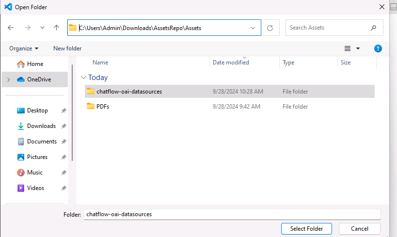

# Exercise 06 - Integrate the chatbot with the Contoso Hotel application

At this point you have a chatbot that can query the hotel brochures. In this exercise, you will integrate the chatbot into the updated Contoso Hotel application.


#### **What you will learn**

After completing the tasks in this exercise, you will be able to:

- Run the chtabot locally.
- Containerize the flow and push the flow to ACR.
- Deploy the flow to Azure Contianer apps and configure environment variables.
- Update the Contoso Hotel app to display the chtabot page.

## Exercise Duration

* **Estimated Time:** 30 minutes

---

# Task 01 - Set up Visual Studio Code and run the flow locally

<!--- Estimated time: 15 minutes---> 

## Introduction


## Description

In this task you will test the chatbot locally before you publish the chatbot.

The key steps are as follows:

1. Configure your development evironment in Visual Studio Code.
1. Create an enviornment file for the chatbot.
1. Create a connection to Azure OpenAI.
1. Run the chatbot locally to test the chatbot.


## Success Criteria

- You have set up your development enviornment.
- You have tested the chatbot locally.

## Learning Resources

- [**Deploy a flow using Docker**](https://microsoft.github.io/promptflow/how-to-guides/deploy-a-flow/deploy-using-docker.html)
- [**Prompt flow documentation**](https://microsoft.github.io/promptflow/reference/pf-command-reference.html#pf-flow)

## Solution

<details markdown="block">
<summary>Expand this section to view the solution</summary>

1. Open File Explorer and go to the Downloads\AssetsRepo\Assets folder.

1. Double-click **chatflow-oai-datasources.zip**. Select **Extract all** and then select **Extract**.

1. Launch Visual Studio Code as an administrator.

1. From the menu bar, select **File** and then select **Open Folder**.

1. Select **AssetsRepo** and then select **Select folder**.

    

1. Select the option to Trust the authors.

1. In the Explorer pane, expand **chatflow-oai-datasources**.

1. Right-click **.env.sample** and then slect **Rename**. Rename the file to **.env**.

1. Select **.env** to open the file in an Editor window.

1. Update the variables to use the same values that you used in Exercise 05, Task 01, Step 05. Save your changes and close the file.
    ```
    AZURE_OPENAI_ENDPOINT="https://azureopenai62143490.openai.azure.com/"
    AZURE_OPENAI_API_KEY="08c96b97791e44ea83c4dff67a76eb32"
    AZURE_OPENAI_DEPLOYMENT_ID="gpt-4o"
    AZURE_AI_SEARCH_ENDPOINT="https://contososrch799498.search.windows.net"
    AZURE_AI_SEARCH_INDEX="vector-1727543906118"
    AZURE_AI_SEARCH_API_KEY="ctkSfXrdBMgyYEIFOkECVmrWrdcRioV7wyAfqRVSNGAzSeAsUWls"
    PGHOST="mg32xpzwcffkg.postgres.database.azure.com"
    PGPORT="5432"
    PGUSER="contosoadmin"
    PGDATABASE="postgres"
    PGPASSWORD="1234ABCD!"
    ```

    {: .note }
    > To locate the values for AZURE_OPENAI_ENDPOINT and AZURE_OPENAI_API_KEY, in the Azure portal, select the Azure OpenAI resource you created. In the Resource Management section, select **Keys and Endpoints**. Use the Endpoint URL for AZURE_OPENAI_ENDPOINT and the key 1 value for AZURE_OPENAI_API_KEY.

    {: .note }
    > To locate the values for AZURE_AI_SEARCH_ENDPOINT, AZURE_AI_SEARCH_INDEX, and AZURE_AI_SEARCH_API_KEY, in the Azure portal, select the Search Service instance you created.  On the Overview page, use the URL for AZURE_AI_SEARCH_ENDPOINT. In the left hand navigaation pane, in the Search Management section, select **Indexes**. Use the index name for AZURE_AI_SEARCH_INDEX. In the left hand navigation pane, in the Settings section, select **Keys**. Use Primary admin key for AZURE_AI_SEARCH_API_KEY.
    
    {: .note }
    > For all parameters that start with "PG", use the values from the PostgreSQL connection string that you recorded earlier in the lab.

1. Enter the following commands at the Terminal window prompt. These commands create environment variables. 

    ```
    get-content .env | foreach {
    $name, $value = $_.split('=')
    set-content env:\$name $value
    }
    ```
	
1. Enter the following command at the Visual Studio Code Terminal window prompt. This command creates a connection to Azure Open AI.

    ```
    # open ai connection
    pf connection create --file azure_openai.yaml --name azure_openai --set "api_base=$env:AZURE_OPENAI_ENDPOINT" --set "api_key=$env:AZURE_OPENAI_API_KEY"
    # ai search connection
    pf connection create --file azure_ai_search.yaml --name azure_ai_search --set "api_base=$env:AZURE_AI_SEARCH_ENDPOINT" --set "api_key=$env:AZURE_AI_SEARCH_API_KEY"
    # postgresql connection
    pf connection create --file postgresql.yaml --name postgresql --set "configs.hostname=$env:PGHOST" --set "configs.port=$env:PGPORT" --set "configs.user=$env:PGUSER" --set "configs.database=$env:PGDATABASE" --set "secrets.passwd=$env:PGPASSWORD"
    ```
	
1. Enter the following command at the Terminal window prompt. This command lists all connections.

    ```
    pf connection list | ConvertFrom-Json | Select-Object name, type |Format-Table
    ```

    

1. Enter the following command at the Terminal window prompt. This command installs all dependencies listed in the requirements.txt file.

    ```
	pip install -r requirements.txt
	```

1. Enter the following commands at the Terminal window prompt. These commands run the flow interactively so that you can peform testing.

    ```
    pf flow test --flow . --interactive
    ```

</details>

---
# Task 02 - Deploy the flow to Azure Container apps and test the app

<!--- Estimated time: 15 minutes---> 

## Introduction


## Description

In this task you will prepare the flow for deployment and deploy the flow. You will update the app to display the chatbot page.

The key steps are as follows:

1. Containerize the flow and push the flow to ACR.
1. Deploy the Container app and configure environmental variables.
1. Update the Contoso Hotel app to display the chatbot page


## Success Criteria

- You have updated the app to include the chatbot feature.

## Learning Resources

- [**Deploy a flow using Docker**](https://microsoft.github.io/promptflow/how-to-guides/deploy-a-flow/deploy-using-docker.html)
- [**Promptflow Reference**](https://microsoft.github.io/promptflow/reference/pf-command-reference.html#pf-flow)

## Solution

<details markdown="block">
<summary>Expand this section to view the solution</summary>

1. Enter the following commands in the Visual Studio Code Terminal window prompt. These commands containerize the flow and push the flow to ACR.

    ```
    # login to acr
    az acr login --name "$ACR_NAME"
    # create flow
    pf flow build --source . --output docker-dist --format docker
    # copy the azure_openai.yaml, azure_ai_search.yaml, and postgresql.yaml into the connections folder
    Copy-Item -Path .\azure_openai.yaml -Destination .\docker-dist\connections -Force
    Copy-Item -Path .\azure_ai_search.yaml -Destination .\docker-dist\connections -Force
    Copy-Item -Path .\postgresql.yaml -Destination .\docker-dist\connections -Force
    # build container
    docker build -t "$ACR_NAME.azurecr.io/chatbot:v1.0.0" ./docker-dist
    # push it to acr
    docker push "$ACR_NAME.azurecr.io/chatbot:v1.0.0"
    # have an overview of defined environment variables
    Get-ChildItem -Path '.\docker-dist\connections' -Filter '*.yaml' | Get-Content | Select-String 'env:'
    # clean up
    Remove-Item -Recurse -Force ./docker-dist
    ```

	{: .note } 
	> Promptflow creates the connection yaml files in the connections folder based on the pf connection command. Ensure, that just 3 connections are defined and the names are azure_openai, azure_ai_search, and postgresql.


1. Update the values for the variables in the following commands. Enter the following commands in the Visual Studio Code Terminal window prompt. These commands deploy the container to ACR and set envrionment variables.

    ```
    az containerapp create --name "chatbot" --resource-group "$RG_NAME" --environment "$CONTOSO_HOTEL_ENV" `
    --image "$ACR_NAME.azurecr.io/chatbot:v1.0.0" --target-port 8080 --ingress internal --transport http `
    --registry-server "$ACR_NAME.azurecr.io" --registry-username "$ACR_NAME" --registry-password "$CONTOSO_ACR_CREDENTIAL" `
    --secrets "searchkey=$AZURE_AI_SEARCH_API_KEY" "openaikey=$AZURE_OPENAI_API_KEY" "pgpassword=$PGPASSWORD" `
    --env-vars "AZURE_AI_SEARCH_ENDPOINT=$AZURE_AI_SEARCH_ENDPOINT" "AZURE_AI_SEARCH_API_KEY=secretref:searchkey" `
    "AZURE_OPENAI_ENDPOINT=$AZURE_OPENAI_ENDPOINT" "AZURE_OPENAI_API_KEY=secretref:openaikey" `
    "PGHOST=$PGHOST" "PGPORT=$PGPORT" "PGUSER=$PGUSER" "PGDATABASE=$PGDATABASE" "PGPASSWORD=secretref:pgpassword"
    $CONTOSO_CHATBOT_URL = "https://$(az containerapp show --name "chatbot" --resource-group "$RG_NAME" --query 'properties.configuration.ingress.fqdn' -o tsv)"
    Write-Host -ForegroundColor Green  "Promptflow URL is: $CONTOSO_CHATBOT_URL"
    ```

	{: .note }
	> Record the value for the chatbot URL. You will need this value in the following step.


1. Enter the following commands in the Visual Studio Code Terminal window prompt. These commands update the application front-end.

    ```
    az containerapp update --name "frontend" --resource-group "$RG_NAME" --set-env-vars "CHATBOT_BASEURL=$CONTOSO_BACKEND_URL"
    az containerapp update --name "backend" --resource-group "$RG_NAME" --set-env-vars "CHATBOT_BASEURL=$CONTOSO_CHATBOT_URL"
    ```
	
1. Test the solution.   
