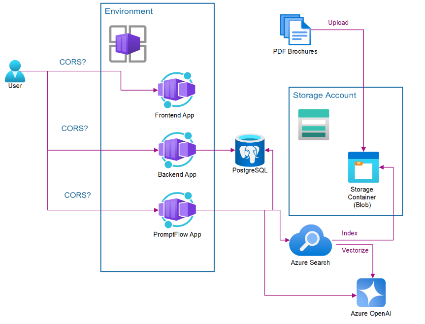
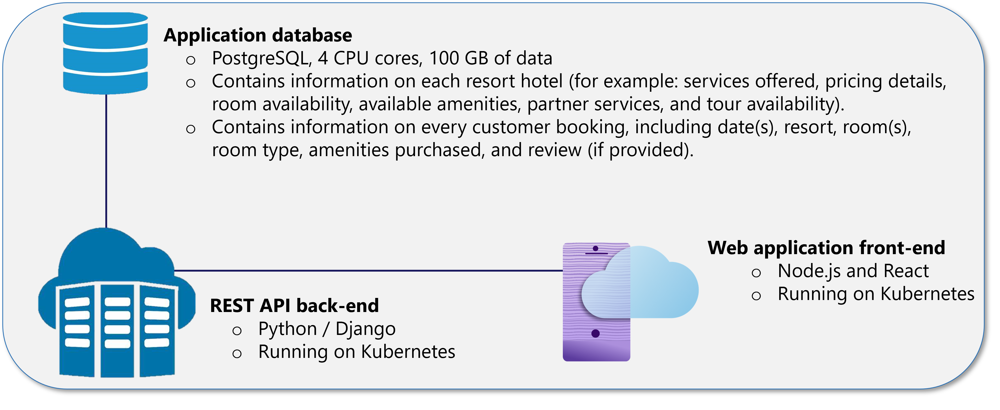

# TechExcel: Modernize applications to be AI ready (level 300 / CSU) lab

**The estimated time to complete this lab is 360 minutes.**

Contoso Suites is a luxury hotel chain owning properties in seven countries, including the United States, Costa Rica, French Guiana, and several Caribbean islands. A large amount of marketing for Contoso Suites comes from word of mouth. The company is strategically modernizing its technology to further adopt cloud infrastructure, as well as leverage AI.

Contoso Suites is strategically modernizing its technology to further adopt cloud infrastructure, as well as leverage AI. The company is migrating from on-premises data centers to Azure cloud services, addressing legacy system scalability, and maintenance cost challenges.

The Contoso Suites application is a legacy system, hosted on-premises, which has a three-tier pattern in support of Contoso’s digital commerce website. 

**The goal of this lab is to modernize a legacy application to be AI-ready by containerizing its components, deploying them in Azure, and integrating AI services such as Azure OpenAI and Search to enhance functionality with intelligent chatbot capabilities.**

To successfully complete this lab, you need to perform the following tasks:

- **Install client tools**: Identify required tools like Visual Studio Code, PowerShell, Azure CLI, and Git, and install or update them as necessary.
- **Set up and configure Azure resources**: Select a region that supports Azure AI services, create a resource group, and provision the necessary resources for the lab.
- **Deploy the legacy app**: Clone the GitHub repository, build a Docker container for the app, and push the container to Azure Container Registry (ACR).
- **Provision the database**: Deploy a PostgreSQL database in Azure to support the app and run the containerized app with a database connection.
- **Split and repackage app components**: Separate the app’s front-end and back-end components, refactor the code, and deploy the components as containers.
- **Configure Azure Search and OpenAI services**: Upload hotel brochures, configure Azure Search and OpenAI services to extract and index data, and test the search index.
- **Set up and configure AI tools**: Install Promptflow for Visual Studio Code and set up AI services, including an AI hub, to create a chatbot integrated into the Contoso Hotel app.

## Exercises

This lab has exercises on:

- Installing and configuring Visual Studio Code, PowerShell, Azure CLI, Git, and Docker Desktop
- Setting up Azure resources in supported regions and creating a resource group
- Cloning GitHub repositories, building Docker containers, and pushing them to Azure Container Registry
- Provisioning Azure Database for PostgreSQL Flexible Server to support the app
- Running the containerized app, creating a database schema, and populating tables with data
- Splitting front-end and back-end app components and refactoring the code
- Deploying and running the split app components as Docker containers in Azure
- Configuring and using Azure Blob Storage, Azure Search Service, and Azure OpenAI Service to extract and index data from hotel brochures
- Setting up managed identities for secure communication between Azure services
- Importing and configuring pre-built flows in PromptFlow, testing flows, and integrating chatbot functionality into the Contoso Hotel app

## Disclaimer

This presentation, demonstration, and demonstration model are for informational purposes only and (1) are not subject to SOC 1 and SOC 2 compliance audits, and (2) are not designed, intended or made available as a medical device(s) or as a substitute for professional medical advice, diagnosis, treatment or judgment. Microsoft makes no warranties, express or implied, in this presentation, demonstration, and demonstration model. Nothing in this presentation, demonstration, or demonstration model modifies any of the terms and conditions of Microsoft’s written and signed agreements. This is not an offer and applicable terms and the information provided are subject to revision and may be changed at any time by Microsoft.

This presentation, demonstration, and demonstration model do not give you or your organization any license to any patents, trademarks, copyrights, or other intellectual property covering the subject matter in this presentation, demonstration, and demonstration model.

The information contained in this presentation, demonstration and demonstration model represents the current view of Microsoft on the issues discussed as of the date of presentation and/or demonstration, for the duration of your access to the demonstration model. Because Microsoft must respond to changing market conditions, it should not be interpreted to be a commitment on the part of Microsoft, and Microsoft cannot guarantee the accuracy of any information presented after the date of presentation and/or demonstration and for the duration of your access to the demonstration model.

No Microsoft technology, nor any of its component technologies, including the demonstration model, is intended or made available as a substitute for the professional advice, opinion, or judgment of (1) a certified financial services professional, or (2) a certified medical professional. Partners or customers are responsible for ensuring the regulatory compliance of any solution they build using Microsoft technologies.

## Copyright

© 2024 Microsoft Corporation. All rights reserved. 

By using this demo/lab, you agree to the following terms:

The technology/functionality described in this demo/lab is provided by Microsoft Corporation for purposes of obtaining your feedback and to provide you with a learning experience. You may only use the demo/lab to evaluate such technology features and functionality and provide feedback to Microsoft. You may not use it for any other purpose. You may not modify, copy, distribute, transmit, display, perform, reproduce, publish, license, create derivative works from, transfer, or sell this demo/lab or any portion thereof.

COPYING OR REPRODUCTION OF THE DEMO/LAB (OR ANY PORTION OF IT) TO ANY OTHER SERVER OR LOCATION FOR FURTHER REPRODUCTION OR REDISTRIBUTION IS EXPRESSLY PROHIBITED.

THIS DEMO/LAB PROVIDES CERTAIN SOFTWARE TECHNOLOGY/PRODUCT FEATURES AND FUNCTIONALITY, INCLUDING POTENTIAL NEW FEATURES AND CONCEPTS, IN A SIMULATED ENVIRONMENT WITHOUT COMPLEX SET-UP OR INSTALLATION FOR THE PURPOSE DESCRIBED ABOVE. THE TECHNOLOGY/CONCEPTS REPRESENTED IN THIS DEMO/LAB MAY NOT REPRESENT FULL FEATURE FUNCTIONALITY AND MAY NOT WORK THE WAY A FINAL VERSION MAY WORK. WE ALSO MAY NOT RELEASE A FINAL VERSION OF SUCH FEATURES OR CONCEPTS. YOUR EXPERIENCE WITH USING SUCH FEATURES AND FUNCITONALITY IN A PHYSICAL ENVIRONMENT MAY ALSO BE DIFFERENT.
